# shop_project


## Учасники команди

- [Dima Chepikov(Team Lead)](https://github.com/dimachep1408)
- [Renat Belei](https://github.com/renatBelei)  
- [Mihail Barilo](https://github.com/Mbarilo)

## Опис проекту

Цей проект є інтернет магазином з красивим мінімалістичним дизайном. Тут є функція реєстрації, авторизації, всі дані зберігаються у базі даних. Є функція адміністратора, який може видаляти, змінювати, додавати нові товари. Також є телеграм бот, у якому адміністратор може переглядати всі товари, додавати нові товари, переглядати всіх користувачів.


## Корисність проекту

Проект "shop_project" є корисним для багатьох категорій користувачів. Він забезпечує просту і зручну платформу для покупок в інтернеті, дозволяючи користувачам реєструватися, авторизуватися та взаємодіяти з широким асортиментом товарів.

### Для новачків у програмуванні
Цей проект є цінним інструментом для новачків у веб-розробці, оскільки він охоплює всі необхідні аспекти створення повноцінного вебсайту. Під час роботи над проектом, ви дізнаєтеся, як реалізувати функції реєстрації та авторизації, працювати з базами даних, а також створювати адміністраторські панелі для управління контентом сайту.

### Можливості для замовника
Проект має всі необхідні функції для створення повноцінного інтернет-магазину, включаючи:
- Зручний інтерфейс для покупців
- Надійна система зберігання даних
- Функції адміністратора для керування товарами
- Інтеграція з Telegram ботом для зручного керування магазином

Цей проект демонструє можливість створення професійного та функціонального вебсайту, що є корисним як для розробників, так і для кінцевих користувачів.

## Початок роботи

### Вимоги

Для запуску проекту необхідно встановити наступні модулі:

- **Flask**: 
    Цей модуль є базою для всього проекту. Всі веб-сторінки та зв'язок з HTML кодом відбувається через Flask.
- **Flask-Migrate**: 
    Цей підмодуль потрібен для проведення "міграцій" (оновлення) змін у базі даних. Наприклад, якщо ви додали новий стовбчик до моделі (таблиці), він автоматично не додасться до пам'яті бази даних, тому потрібно власноруч оновлювати зміни.
- **Flask-SQLAlchemy**: 
    Цей підмодуль потрібен для зв'язку з базою даних.
- **Flask-login**:
    Цей модуль потрібен для контроля інформації який саме користувач увійшов у свій акаунт
- **Flask-mail**:
    Цей модуль потрібен для відправлення листа на gmail
- **pandas**: 
    Цей модуль потрібен для зв'язку та обробки даних.
- **telebot**: 
    Цей модуль використовується для створення та контролю телеграм бота, в якому адміністратор може переглядати всіх зареєстрованих користувачів та всі товари, а також додавати товари.

### Інструкція по запуску

1. **Запуск локально:**
   - Запустіть файл `manage.py` для запуску веб-сайту.
   - Відкрийте термінал у папці `bot_app` і введіть команду `python main.py` для запуску телеграм бота.

2. **Віддалено (на PythonAnywhere):**
   - Увійдіть у свій акаунт на [PythonAnywhere](https://www.pythonanywhere.com/).
   - Перейдіть на вкладку "Consoles"
    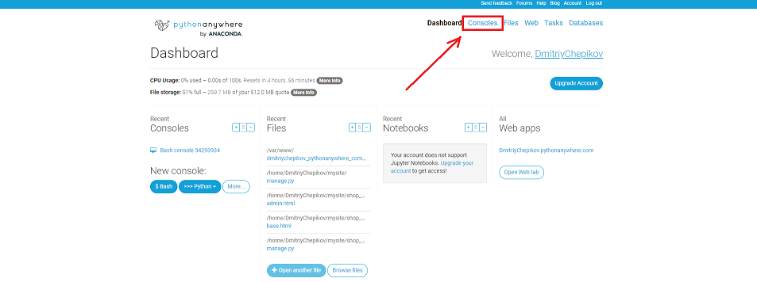
   - Нажміть на bash 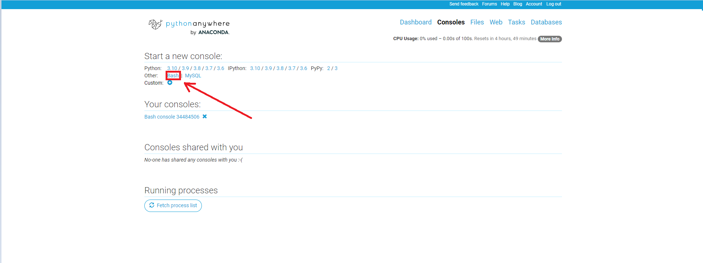
   - Копіювати посилання проекта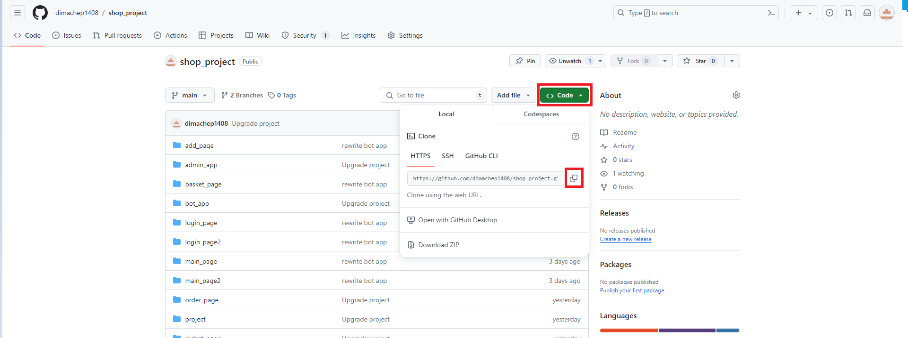
   - Повернутися у консоль та написати `cd mysite`
   - Повирнутися у консоль та написати `git clone (Вставити ссилку)`
   - Повернутися у вкладку web та заминити "Code" як на зображені 
   - Та нажати на вкладку "wsgi configuration"
   - Тепер треба замінити 16 рядок як на фото
   - 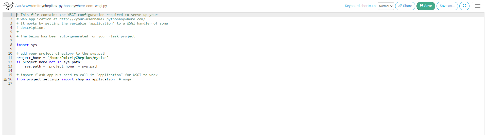
   - Нажати на save Справа зверху, та повертаємось на сторінку назад
   - Повертаємось у консоль та прописуємо `cd ../.virtualenvs` та натискаємо Enter, пишемо `python -m venv shop_venv`, `cd bin` і `source activate`

   - Далі встановлюємо всі модулі які прописані вищє за допомогою `pip install назва модуля`
   - повернутися до web та оновити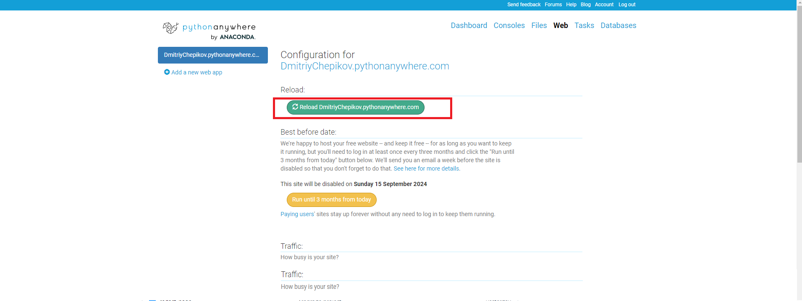
   - натиснути на силку 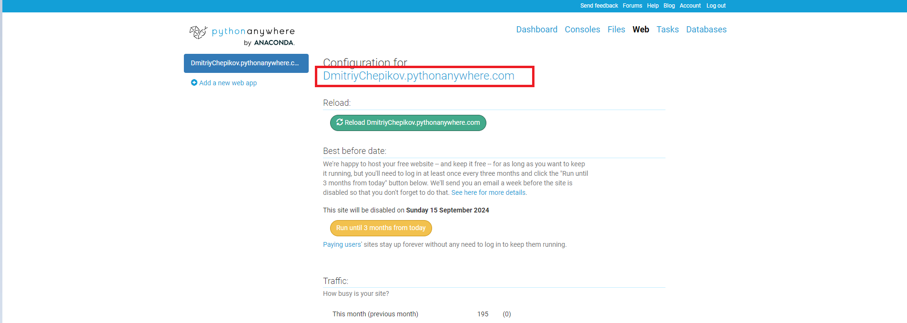

### Більш детальний опис
   - Структура проекту та опис всіх веб-додатків:
   - 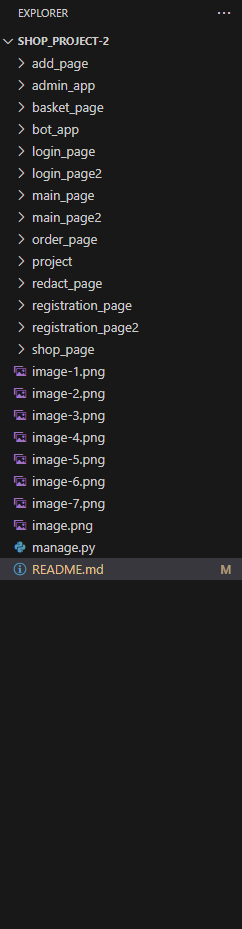

#### add_page
 - Цей веб-додаток доступен тількі для адмінів він виконує функцію додавання товару на сторінці
    - 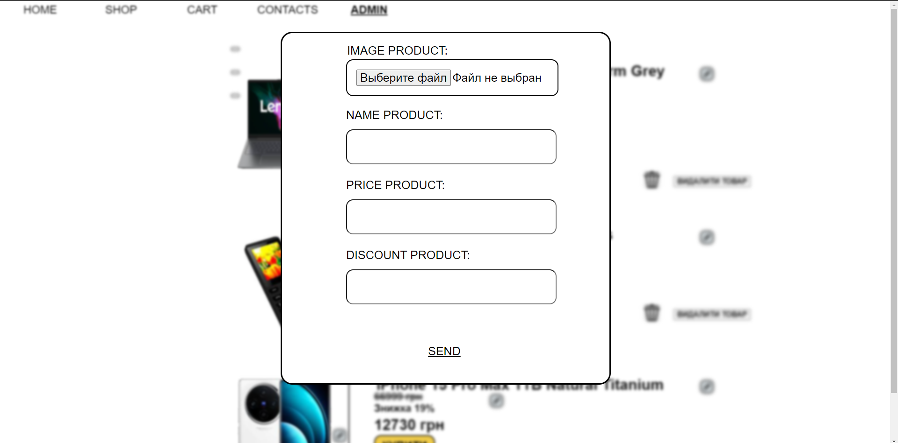
   #### admin_page
    - Цей веб-додаток копія сторінці shop_page але для адмінів на якій є функції видалення, додавання, та редагування товарів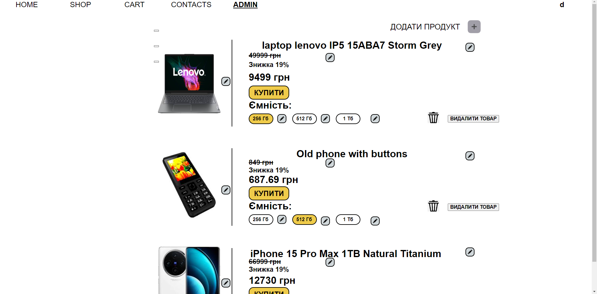
   #### basket_page
    Цей веб додаток відображає усі товари які були куплені на сторінці shop_page також є кнопка оформлення товара та фінальний рахунок з урахуванням знижок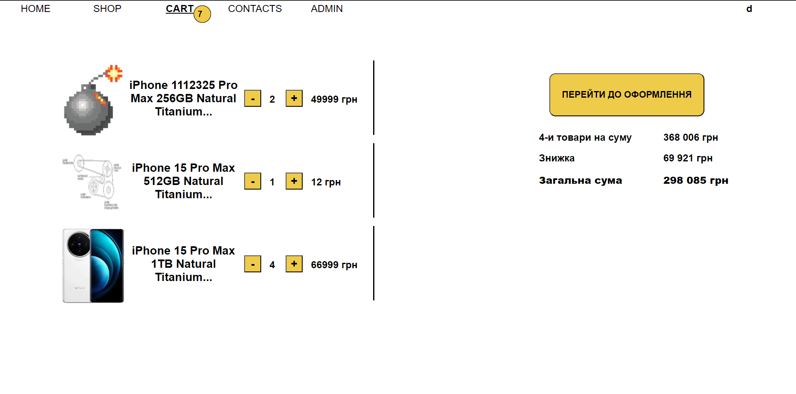
   #### bot_app
    Це не веб-додаток це папка з файлом у якому проізводится управління ботом написаним на модулі telebot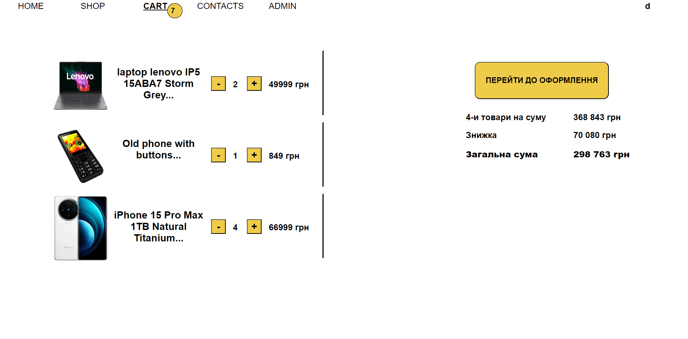
   #### login_page
    Цей веб додаток потрібен для входу у акаунт 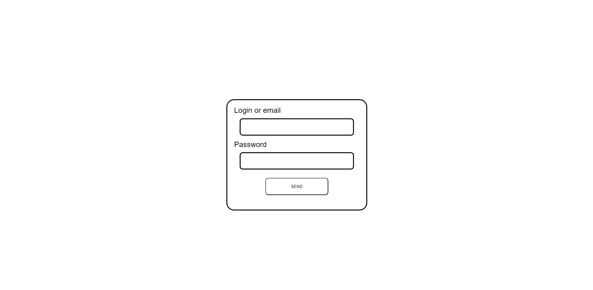
   #### login_page 2
    Цей веб-додаток це модальне вікно яке відкриважтся якщо людина входить у аканунт який не зареєстрований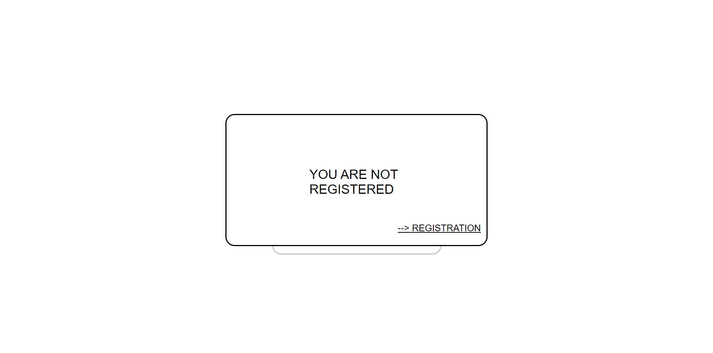
   #### main_page
    Цей веб-додаток, це сторінка для не зареєстрованих юзеров на якому тільки надпис HOME PAGE та дві силки на реєстрацію та авторизацію 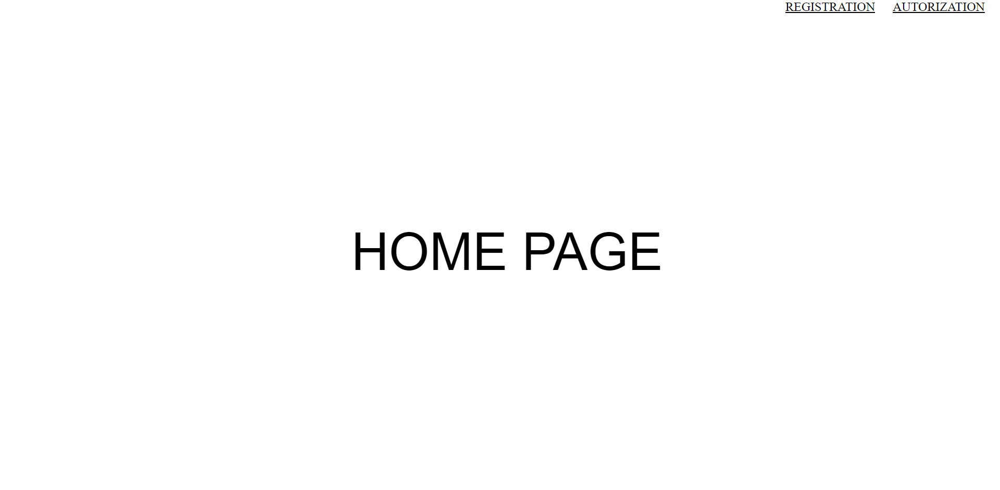
   #### main_page2
    Цей веб-додаток, це основна сторінка для зареєстрованих юзеров на якому тільки надпис HOME PAGE ім'я на яке ви зареєструвались та силки на всі сторінки для зарежєстрованих юзеров
   #### order_page
    Цей веб-додаток потрібен для заповненя листа замовлення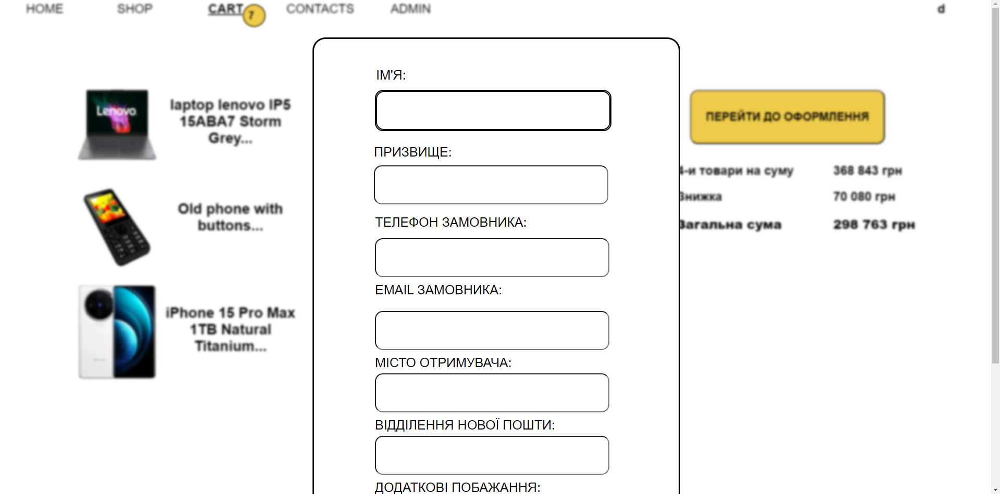 
   #### project
    Це не веб-додаток, це основна папка проекту у якому і зберігаєтся проект та багато інших файлів
   #### redact_page
    Цей веб-додаток потрібен для змінення інформації про товари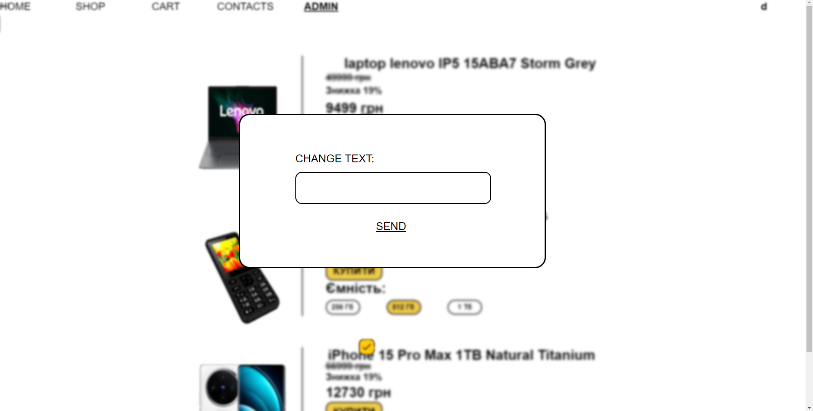
   #### registration_page
    Цей веб-одаток потрібен для реєстрації нових юзеров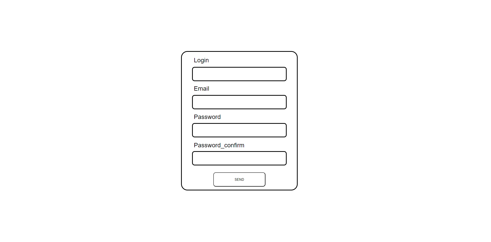
   #### registration_page2
    Цей веб-додаток це модалне вікно яке відкриваєтся коли ви зареєструвались де вас пересилає на сторінку з авторизацієй(login_page)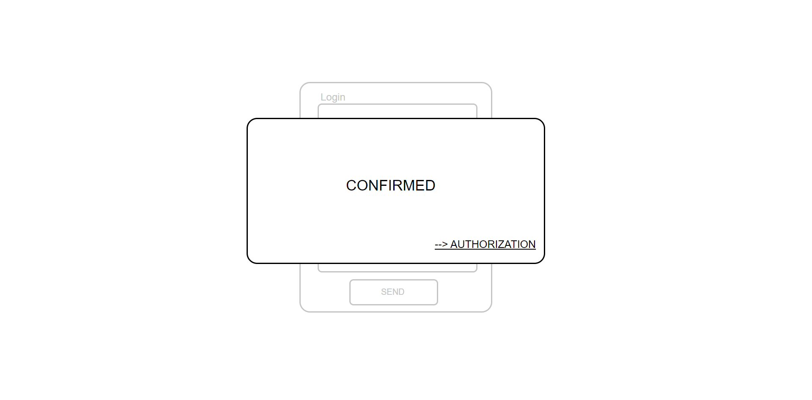

### Всі файли app з blueprint-ами

 #### add_page
  ```python
import flask  # Імпорт бібліотеки Flask / Import the Flask library

# Створення нового Blueprint під назвою 'add'
# Create a new Blueprint named 'add'
add = flask.Blueprint(
    name="add",  # Ім'я Blueprint / Name of the Blueprint
    import_name="app",  # Імпортне ім'я додатка / Import name of the app
    template_folder="add_page/templates",  # Папка з шаблонами для Blueprint / Template folder for the Blueprint
    static_folder="add_page"  # Папка зі статичними файлами для Blueprint / Static folder for the Blueprint
)   
```

 #### admin_page
 ```python
    import flask  # Імпорт бібліотеки Flask / Import the Flask library

# Створення нового Blueprint під назвою 'admin'
# Create a new Blueprint named 'admin'
admin = flask.Blueprint(
    name="admin",  # Ім'я Blueprint / Name of the Blueprint
    import_name="app",  # Імпортне ім'я додатка / Import name of the app
    template_folder="admin_app/templates",  # Папка з шаблонами для Blueprint / Template folder for the Blueprint
    static_folder="admin_app"  # Папка зі статичними файлами для Blueprint / Static folder for the Blueprint
)
```

 #### basket_page
 ```python
import flask  # Імпорт бібліотеки Flask / Import the Flask library

# Створення нового Blueprint під назвою 'basket'
# Create a new Blueprint named 'basket'
basket = flask.Blueprint(
    name="basket",  # Ім'я Blueprint / Name of the Blueprint
    import_name="app",  # Імпортне ім'я додатка / Import name of the app
    template_folder="basket_page/templates",  # Папка з шаблонами для Blueprint / Template folder for the Blueprint
    static_folder="basket_page"  # Папка зі статичними файлами для Blueprint / Static folder for the Blueprint
)
```

 #### login_page
 ```python
import flask  # Імпорт бібліотеки Flask / Import the Flask library

# Створення нового Blueprint під назвою 'login'
# Create a new Blueprint named 'login'
login = flask.Blueprint(
    name="login",  # Ім'я Blueprint / Name of the Blueprint
    import_name="app",  # Імпортне ім'я додатка / Import name of the app
    template_folder="login_page/templates",  # Папка з шаблонами для Blueprint / Template folder for the Blueprint
    static_folder="login_page"  # Папка зі статичними файлами для Blueprint / Static folder for the Blueprint
)
```

 #### login_page2
 ```python
import flask  # Імпорт бібліотеки Flask / Import the Flask library

# Створення нового Blueprint під назвою 'login2'
# Create a new Blueprint named 'login2'
login2 = flask.Blueprint(
    name="login2",  # Ім'я Blueprint / Name of the Blueprint
    import_name="app",  # Імпортне ім'я додатка / Import name of the app
    template_folder="login_page2/templates",  # Папка з шаблонами для Blueprint / Template folder for the Blueprint
    static_folder="login_page2"  # Папка зі статичними файлами для Blueprint / Static folder for the Blueprint
)
```

 #### main_page
 ```python
import flask  # Імпорт бібліотеки Flask / Import the Flask library

# Створення нового Blueprint під назвою 'main'
# Create a new Blueprint named 'main'
main = flask.Blueprint(
    name="main",  # Ім'я Blueprint / Name of the Blueprint
    import_name="app",  # Імпортне ім'я додатка / Import name of the app
    template_folder="main_page/templates",  # Папка з шаблонами для Blueprint / Template folder for the Blueprint
    static_folder="main_page"  # Папка зі статичними файлами для Blueprint / Static folder for the Blueprint
)
```

 #### main_page2
 ```python
import flask  # Імпорт бібліотеки Flask / Import the Flask library

# Створення нового Blueprint під назвою 'main2'
# Create a new Blueprint named 'main2'
main2 = flask.Blueprint(
    name="main2",  # Ім'я Blueprint / Name of the Blueprint
    import_name="app",  # Імпортне ім'я додатка / Import name of the app
    template_folder="main_page2/templates",  # Папка з шаблонами для Blueprint / Template folder for the Blueprint
    static_folder="main_page2"  # Папка зі статичними файлами для Blueprint / Static folder for the Blueprint
)
```

 #### admin_page
 ```python
import flask  # Імпорт бібліотеки Flask / Import the Flask library

# Створення нового Blueprint під назвою 'admin'
# Create a new Blueprint named 'admin'
admin = flask.Blueprint(
name="admin",  # Ім'я Blueprint / Name of the Blueprint
import_name="app",  # Імпортне ім'я додатка / Import name of the app
template_folder="admin_app/templates",  # Папка з шаблонами для Blueprint / Template folder for the Blueprint
static_folder="admin_app"  # Папка зі статичними файлами для Blueprint / Static folder for the Blueprint
)
```

 #### order_page
 ```python
import flask  # Імпорт бібліотеки Flask / Import the Flask library

# Створення нового Blueprint під назвою 'order'
# Create a new Blueprint named 'order'
order = flask.Blueprint(
    name="order",  # Ім'я Blueprint / Name of the Blueprint
    import_name="app",  # Імпортне ім'я додатка / Import name of the app
    template_folder="order_page/templates",  # Папка з шаблонами для Blueprint / Template folder for the Blueprint
    static_folder="order_page"  # Папка зі статичними файлами для Blueprint / Static folder for the Blueprint
)
```

 #### redact_page
 ```python
import flask  # Імпорт бібліотеки Flask / Import the Flask library

# Створення нового Blueprint під назвою 'redact'
# Create a new Blueprint named 'redact'
redact = flask.Blueprint(
    name="redact",  # Ім'я Blueprint / Name of the Blueprint
    import_name="app",  # Імпортне ім'я додатка / Import name of the app
    template_folder="redact_page/templates",  # Папка з шаблонами для Blueprint / Template folder for the Blueprint
    static_folder="redact_page"  # Папка зі статичними файлами для Blueprint / Static folder for the Blueprint
)
```

 #### registration_page
 ```python
import flask  # Імпорт бібліотеки Flask / Import the Flask library

# Створення нового Blueprint під назвою 'registration'
# Create a new Blueprint named 'registration'
registration = flask.Blueprint(
    name="registration",  # Ім'я Blueprint / Name of the Blueprint
    import_name="app",  # Імпортне ім'я додатка / Import name of the app
    template_folder="registration_page/templates",  # Папка з шаблонами для Blueprint / Template folder for the Blueprint
    static_folder="registration_page"  # Папка зі статичними файлами для Blueprint / Static folder for the Blueprint
)
```

 #### registration_page2
 ```python
import flask  # Імпорт бібліотеки Flask / Import the Flask library

# Створення нового Blueprint під назвою 'registration2'
# Create a new Blueprint named 'registration2'
registration2 = flask.Blueprint(
    name="registration2",  # Ім'я Blueprint / Name of the Blueprint
    import_name="app",  # Імпортне ім'я додатка / Import name of the app
    template_folder="registration_page2/templates",  # Папка з шаблонами для Blueprint / Template folder for the Blueprint
    static_folder="registration_page2"  # Папка зі статичними файлами для Blueprint / Static folder for the Blueprint
)

```

 #### shop_page
 ```python
import flask  # Імпорт бібліотеки Flask / Import the Flask library

# Створення нового Blueprint під назвою 'shop'
# Create a new Blueprint named 'shop'
shop = flask.Blueprint(
    name="shop",  # Ім'я Blueprint / Name of the Blueprint
    import_name="app",  # Імпортне ім'я додатка / Import name of the app
    template_folder="shop_page/templates",  # Папка з шаблонами для Blueprint / Template folder for the Blueprint
    static_folder="shop_page"  # Папка зі статичними файлами для Blueprint / Static folder for the Blueprint
)

```

### Налаштування всіх blueprint-ов
 ```python
import main_page  # Імпорт головної сторінки / Importing the main page
import registration_page  # Імпорт сторінки реєстрації / Importing the registration page
from .settings import shop  # Імпорт налаштувань магазину / Importing shop settings
import login_page  # Імпорт сторінки входу / Importing the login page
import login_page2  # Імпорт другої сторінки входу / Importing the second login page
import main_page2  # Імпорт другої головної сторінки / Importing the second main page
import registration_page2  # Імпорт другої сторінки реєстрації / Importing the second registration page
import shop_page  # Імпорт сторінки магазину / Importing the shop page
import basket_page  # Імпорт сторінки кошика / Importing the basket page
import admin_app  # Імпорт адміністративної сторінки / Importing the admin page
import redact_page  # Імпорт сторінки редагування / Importing the redact page
import add_page  # Імпорт сторінки додавання / Importing the add page
import order_page  # Імпорт сторінки замовлення / Importing the order page

main_page.main.add_url_rule(rule="/", view_func=main_page.render_main)  # Додавання правила URL для головної сторінки / Adding URL rule for the main page
registration_page.registration.add_url_rule(rule="/registration/", view_func=registration_page.render_registration, methods=["GET", "POST"])  # Додавання правила URL для сторінки реєстрації / Adding URL rule for the registration page
login_page.login.add_url_rule(rule="/login/", view_func=login_page.render_login, methods=["GET", "POST"])  # Додавання правила URL для сторінки входу / Adding URL rule for the login page
login_page2.login2.add_url_rule(rule="/login2/", view_func=login_page2.render_login2, methods=["GET", "POST"])  # Додавання правила URL для другої сторінки входу / Adding URL rule for the second login page
main_page2.main2.add_url_rule(rule="/main2/", view_func=main_page2.render_main2, methods=["GET", "POST"])  # Додавання правила URL для другої головної сторінки / Adding URL rule for the second main page
registration_page2.registration2.add_url_rule(rule="/registration2/", view_func=registration_page2.render_registration2, methods=["GET", "POST"])  # Додавання правила URL для другої сторінки реєстрації / Adding URL rule for the second registration page
shop_page.shop.add_url_rule(rule="/shop/", view_func=shop_page.render_shop, methods=["GET", "POST"])  # Додавання правила URL для сторінки магазину / Adding URL rule for the shop page
basket_page.basket.add_url_rule(rule="/basket/", view_func=basket_page.render_basket, methods=["GET", "POST"])  # Додавання правила URL для сторінки кошика / Adding URL rule for the basket page
admin_app.admin.add_url_rule(rule="/admin/", view_func=admin_app.render_admin, methods=["GET", "POST"])  # Додавання правила URL для адміністративної сторінки / Adding URL rule for the admin page
redact_page.redact.add_url_rule(rule="/admin/redact/", view_func=redact_page.render_redact, methods=["GET", "POST"])  # Додавання правила URL для сторінки редагування / Adding URL rule for the redact page
add_page.add.add_url_rule(rule="/shop/add/", view_func=add_page.render_add, methods=["GET", "POST"])  # Додавання правила URL для сторінки додавання / Adding URL rule for the add page
order_page.order.add_url_rule(rule="/basket/order/", view_func=order_page.render_order, methods=["GET", "POST"])  # Додавання правила URL для сторінки замовлення / Adding URL rule for the order page

shop.register_blueprint(blueprint=main_page2.main2)  # Реєстрація блоку коду для другої головної сторінки / Registering blueprint for the second main page
shop.register_blueprint(blueprint=main_page.main)  # Реєстрація блоку коду для головної сторінки / Registering blueprint for the main page
shop.register_blueprint(blueprint=registration_page.registration)  # Реєстрація блоку коду для сторінки реєстрації / Registering blueprint for the registration page
shop.register_blueprint(blueprint=login_page.login)  # Реєстрація блоку коду для сторінки входу / Registering blueprint for the login page
shop.register_blueprint(blueprint=login_page2.login2)  # Реєстрація блоку коду для другої сторінки входу / Registering blueprint for the second login page
shop.register_blueprint(blueprint=registration_page2.registration2)  # Реєстрація блоку коду для другої сторінки реєстрації / Registering blueprint for the second registration page
shop.register_blueprint(blueprint=shop_page.shop)  # Реєстрація блоку коду для сторінки магазину / Registering blueprint for the shop page
shop.register_blueprint(blueprint=basket_page.basket)  # Реєстрація блоку коду для сторінки кошика / Registering blueprint for the basket page
shop.register_blueprint(blueprint=admin_app.admin)  # Реєстрація блоку коду для адміністративної сторінки / Registering blueprint for the admin page
shop.register_blueprint(blueprint=redact_page.redact)  # Реєстрація блоку коду для сторінки редагування / Registering blueprint for the redact page
shop.register_blueprint(blueprint=add_page.add)  # Реєстрація блоку коду для сторінки додавання / Registering blueprint for the add page
shop.register_blueprint(blueprint=order_page.order)  # Реєстрація блоку коду для сторінки замовлення / Registering blueprint for the order page

 ```


### Файли у директорії project

 #### settings
 - Цей файл у якому зберігаєтся дані про проект 
 ```python
import flask  # Імпорт фреймворку Flask / Importing the Flask framework
import flask_migrate  # Імпорт Flask-Migrate для міграцій бази даних / Importing Flask-Migrate for database migrations
import flask_sqlalchemy  # Імпорт Flask-SQLAlchemy для управління базою даних / Importing Flask-SQLAlchemy for database management
import os  # Імпорт модуля os для роботи з операційною системою / Importing os module for operating system functionality

shop = flask.Flask(
    import_name="settings",  # Встановлення імені для імпорту Flask додатка / Setting import name for the Flask app
    template_folder="project/templates",  # Встановлення шляху до теки з шаблонами / Setting template folder path
    instance_path=os.path.abspath(__file__ + "/.."),  # Встановлення шляху до інстанції для конфігурації / Setting instance path for configuration
    static_folder="/project/static/css"  # Встановлення шляху до теки зі статичними файлами / Setting static folder path
)

shop.config["SQLALCHEMY_DATABASE_URI"] = "sqlite:///data.db"  # Налаштування URI бази даних SQLite / Configuring SQLite database URI

DATABASE = flask_sqlalchemy.SQLAlchemy(app=shop)  # Створення екземпляру SQLAlchemy для додатка Flask / Creating SQLAlchemy database instance for the Flask app
MIGRATE = flask_migrate.Migrate(app=shop, db=DATABASE)  # Створення екземпляру Flask-Migrate для міграцій бази даних / Creating Flask-Migrate instance for database migrations

 ```

  #### login_manager
 - Цей файл налаштовує авторизацію юзеров
 ```python
import flask_login  # Імпорт Flask-Login для управління сесіями користувачів / Importing Flask-Login for user session management
from .settings import shop  # Імпорт налаштувань магазину з модуля settings / Importing shop settings from the settings module
from registration_page.models import User  # Імпорт моделі User з модуля registration_page.models / Importing User model from registration_page.models

shop.secret_key = "SECRET_KEY123"  # Встановлення секретного ключа для захисту сесій / Setting secret key for session protection
login_manager = flask_login.LoginManager(app=shop)  # Створення екземпляру LoginManager для додатка Flask / Creating LoginManager instance for the Flask app

@login_manager.user_loader
def load_user(id):
    return User.query.get(id)  # Функція-завантажувач для отримання користувача за його ідентифікатором з бази даних / Loader function to retrieve a user by ID from the database

 ```

  #### mail_config
 - Цей файл налаштовує відправку повідомлень на gmail
 ```python
from flask_mail import Mail  # Імпорт класу Mail з Flask-Mail для роботи з електронною поштою / Importing the Mail class from Flask-Mail for email functionality
from .settings import shop  # Імпорт налаштувань магазину з модуля settings / Importing shop settings from the settings module

ADMINISTRATOR_ADDRESS = "chepikovdima1@gmail.com"  # Встановлення адреси адміністратора для електронної пошти / Setting administrator email address
ADMINISTRATOR_PASSWORD = "23456180D!m@"  # Встановлення пароля адміністратора для електронної пошти / Setting administrator email password

shop.config["MAIL_SERVER"] = "smtp.gmail.com"  # Налаштування SMTP сервера для Gmail / Configuring SMTP server for Gmail
shop.config["MAIL_PORT"] = 587  # Встановлення порту SMTP для Gmail / Setting SMTP port for Gmail
shop.config["MAIL_USE_TLS"] = True  # Включення використання TLS для шифрування електронної пошти / Enabling TLS encryption for secure email transmission
shop.config["MAIL_USERNAME"] = ADMINISTRATOR_ADDRESS  # Встановлення користувача електронної пошти (адреса адміністратора) / Setting email username (administrator's address)
shop.config["MAIL_PASSWORD"] = ADMINISTRATOR_PASSWORD  # Встановлення пароля електронної пошти (пароль адміністратора) / Setting email password (administrator's password)

mail = Mail(shop)  # Створення екземпляру Mail з налаштованим додатком Flask (shop) / Creating a Mail instance with the configured Flask application (shop)

 ```


### html Файли
 #### add_page
 ```html
  <!-- Розширення базового шаблону base.html / Extends the base.html template -->

Page Home  <!-- Встановлення заголовка сторінки "Page Home" / Sets the title of the page to "Page Home" -->

  <!-- Визначення блоку заголовку / Defines the header block -->
    <link rel="stylesheet" href="{{ url_for('add.static', filename='/static/css/styles.css') }}"/>  <!-- Підключення зовнішнього CSS-стилю / Links to an external CSS stylesheet -->


  <!-- Визначення блоку контенту / Defines the content block -->

    <h2>{{ log }}</h2>  <!-- Виведення змінної log як заголовок другого рівня / Displays the log variable as a level 2 heading -->

    <!-- Навігаційні посилання / Navigation links -->
    <a class="a1" href="http://127.0.0.1:5000/main2/">HOME</a>
    <a class="a2" href="http://127.0.0.1:5000/shop/">SHOP</a>
    <a class="a3" href="http://127.0.0.1:5000/basket/">CART</a>
    <a class="a4" href="http://127.0.0.1:5000/contacts/">CONTACTS</a>
    <a class="a5" href="http://127.0.0.1:5000/admin/">ADMIN</a>

    <!-- Форма для завантаження інформації про товар / Form for uploading product information -->
    <form method="POST" enctype="multipart/form-data" id="Form">

        <div id="ramkaImageModal">
            <p class="imageTextModal">IMAGE PRODUCT:</p>
            <input type="file" accept="image/*" id="File" name="Image" class="fileInput1">
        </div>

        <div id="ramkaNameProduct">
            <p class="textNameModal">NAME PRODUCT:</p>
            <input type="text" class="inputNameModal" name="Name">
        </div>

        <div id="ramkaPriceModal">
            <p class="textPriceModal">PRICE PRODUCT:</p>
            <input type="text" class="inputPriceModal" name="Price">
        </div>

        <div id="ramkaDiscountModal">
            <p class="textDiscountModal">DISCOUNT PRODUCT:</p>
            <input type="text" class="inputDiscountModal" name="Discount">
        </div>

        <p id="BorderModal"> </p>
        <button id="ButtonModal">SEND</button>  <!-- Кнопка для відправки форми / Submit button for the form -->
    </form>

    <!-- Цикл для виведення інформації про кожний товар / Loop for displaying information about each product -->
    

        
        <div class="div{{ product.id }}">
            <p class="p{{ product.id }}_1">{{ product.name }}</p>  <!-- Назва товару / Product name -->
            <p class="p{{ product.id }}_2"><del>{{ product.price }} грн</del></p>  <!-- Початкова ціна / Original price -->
            <p class="disc_{{ product.id }}">Знижка 19%</p>  <!-- Повідомлення про знижку / Discount message -->
            <p class="final_price_{{ product.id }}">{{ product.final_price }} грн</p>  <!-- Кінцева ціна після знижки / Final price after discount -->
            <button class="button{{ product.id }}_3" onclick="javascript:indicator(); javascript:buy_product.id();javascript:counter()">КУПИТИ</button>  <!-- Кнопка "КУПИТИ" / Purchase button -->
            <p class="p{{ product.id }}_4">Ємність:</p>  <!-- Підпис "Ємність" / Capacity label -->
            <p class="p{{ product.id }}_5"></p>  <!-- Порожнє поле ємності / Empty capacity field -->
            <p class="p{{ product.id }}_5_1">256 Гб</p>  <!-- Варіант ємності 256 Гб / Capacity option 256 GB -->
            <p class="p{{ product.id }}_6"></p>  <!-- Порожнє поле ємності / Empty capacity field -->
            <p class="p{{ product.id }}_6_1">512 Гб</p>  <!-- Варіант ємності 512 Гб / Capacity option 512 GB -->
            <p class="p{{ product.id }}_7"></p>  <!-- Порожнє поле ємності / Empty capacity field -->
            <p class="p{{ product.id }}_7_1">1 Тб</p>  <!-- Варіант ємності 1 Тб / Capacity option 1 TB -->

            <!-- Форма для керування товаром / Form for product management -->
            <form method="post">
                <button class="p{{ product.id }}_8" name="delete" value="{{ product.id }}">ВИДАЛИТИ ТОВАР</button>  <!-- Кнопка видалення товару / Delete product button -->

                <!-- Зображення для операції видалення / Image for delete operation -->
                

                <!-- Кнопки для редагування товару / Buttons for editing the product -->
                <button type="submit" class="btns" name="rewrite" value="rewrite1-{{ product.id }}"></button>
                <button type="submit" class="btns" name="rewrite" value="rewrite2-{{ product.id }}"></button>
                <button type="submit" class="btns" name="rewrite" value="rewrite3-{{ product.id }}"></button> 
                <button type="submit" class="btns" name="rewrite" value="rewrite4-{{ product.id }}"></button>
                <button type="submit" class="btns" name="rewrite" value="rewrite5-{{ product.id }}"></button>
                <button type="submit" class="btns" name="rewrite" value="rewrite6-{{ product.id }}"></button>
            </form>
        </div>

    


 ```


 #### admin_app
 ```html
  <!-- Розширення базового шаблону base.html / Extends the base.html template -->

Page Home  <!-- Встановлення заголовка сторінки "Page Home" / Sets the title of the page to "Page Home" -->

  <!-- Визначення блоку заголовку / Defines the header block -->
    <link rel="stylesheet" href="{{ url_for('admin.static', filename='/static/css/styles.css') }}"/>  <!-- Підключення зовнішнього CSS-стилю / Links to an external CSS stylesheet -->


  <!-- Визначення блоку контенту / Defines the content block -->

    <h2>{{ log }}</h2>  <!-- Виведення змінної log як заголовок другого рівня / Displays the log variable as a level 2 heading -->

    <!-- Навігаційні посилання / Navigation links -->
    <a class="a1" href="/main2/">HOME</a>
    <a class="a2" href="/shop/">SHOP</a>
    <a class="a3" href="/basket/">CART</a>
    <a class="a4" href="/contacts/">CONTACTS</a>
    <a class="a5" href="/admin/">ADMIN</a>

    <!-- Форма для додавання нового продукту / Form for adding a new product -->
    <form method="post">
        <button class="add_btn" name="add_btn">ДОДАТИ ПРОДУКТ</button>  <!-- Кнопка для додавання продукту / Button to add a product -->
          <!-- Зображення для кнопки додавання / Image for add button -->
    </form>

    

        <!-- Відображення кожного продукту / Displaying each product -->
          <!-- Зображення продукту / Product image -->
        <div class="div{{ product.id }}">
            <p class="p{{ product.id }}_1">{{ product.name }}</p>  <!-- Назва продукту / Product name -->
            <p class="p{{ product.id }}_2"><del>{{ product.price }} грн</del></p>  <!-- Початкова ціна / Original price -->
            <p class="disc_{{ product.id }}">Знижка 19%</p>  <!-- Повідомлення про знижку / Discount message -->
            <p class="final_price_{{ product.id }}">{{ product.final_price }} грн</p>  <!-- Кінцева ціна після знижки / Final price after discount -->
            <button class="button{{ product.id }}_3" onclick="javascript:indicator(); javascript:buy_product.id();javascript:counter()">КУПИТИ</button>  <!-- Кнопка "КУПИТИ" / Purchase button -->
            <p class="p{{ product.id }}_4">Ємність:</p>  <!-- Підпис "Ємність" / Capacity label -->
            <p class="p{{ product.id }}_5"></p>  <!-- Порожнє поле ємності / Empty capacity field -->
            <p class="p{{ product.id }}_5_1">256 Гб</p>  <!-- Варіант ємності 256 Гб / Capacity option 256 GB -->
            <p class="p{{ product.id }}_6"></p>  <!-- Порожнє поле ємності / Empty capacity field -->
            <p class="p{{ product.id }}_6_1">512 Гб</p>  <!-- Варіант ємності 512 Гб / Capacity option 512 GB -->
            <p class="p{{ product.id }}_7"></p>  <!-- Порожнє поле ємності / Empty capacity field -->
            <p class="p{{ product.id }}_7_1">1 Тб</p>  <!-- Варіант ємності 1 Тб / Capacity option 1 TB -->

            <!-- Форма для керування товаром / Form for product management -->
            <form method="post">
                <button class="p{{ product.id }}_8" name="delete" value="{{ product.id }}">ВИДАЛИТИ ТОВАР</button>  <!-- Кнопка видалення товару / Delete product button -->

                <!-- Зображення для операції видалення / Image for delete operation -->
                

                <!-- Кнопки для редагування товару / Buttons for editing the product -->
                <button type="submit" class="btns" name="rewrite" value="rewrite1-{{ product.id }}"></button>
                <button type="submit" class="btns" name="rewrite" value="rewrite2-{{ product.id }}"></button>
                <button type="submit" class="btns" name="rewrite" value="rewrite3-{{ product.id }}"></button> 
                <button type="submit" class="btns" name="rewrite" value="rewrite4-{{ product.id }}"></button>
                <button type="submit" class="btns" name="rewrite" value="rewrite5-{{ product.id }}"></button>
                <button type="submit" class="btns" name="rewrite" value="rewrite6-{{ product.id }}"></button>
            </form>
        </div>

    

    <!-- Порожній блок для лічильника або розділювача / Empty block for counter or separator -->
    <p class="count" id="count"></p>
    <p class="border" id="border"></p>

 ```

 #### basket_page

 ```html
  <!-- Розширення базового шаблону base.html / Extends the base.html template -->

Page Home  <!-- Встановлення заголовка сторінки "Page Home" / Sets the title of the page to "Page Home" -->

  <!-- Визначення блоку заголовку / Defines the header block -->
    <link rel="stylesheet" href="{{ url_for('basket.static', filename='/static/css/styles.css') }}"/>  <!-- Підключення зовнішнього CSS-стилю для кошика / Links to an external CSS stylesheet for basket -->


  <!-- Визначення блоку контенту / Defines the content block -->

    <h2>{{ log }}</h2>  <!-- Виведення змінної log як заголовок другого рівня / Displays the log variable as a level 2 heading -->

    <!-- Навігаційні посилання / Navigation links -->
    <a class="a1" href="http://127.0.0.1:5000/">HOME</a>
    <a class="a2" href="http://127.0.0.1:5000/shop/">SHOP</a>
    <a class="a3" href="http://127.0.0.1:5000/basket/">CART</a>
    <a class="a4" href="http://127.0.0.1:5000/contacts/">CONTACTS</a>
    <a class="a5" href="http://127.0.0.1:5000/admin/">ADMIN</a>

    <!-- Кнопки для зменшення кількості продуктів / Buttons to decrease the quantity of products -->
    <button class="button1-" onclick="javascript:minus1Button()">-</button>
    <button class="button2-" onclick="javascript:minus2Button()">-</button>
    <button class="button3-" onclick="javascript:minus3Button()">-</button>

    <!-- Кнопки для збільшення кількості продуктів / Buttons to increase the quantity of products -->
    <button class="button1" onclick="javascript:plus1Button()">+</button>
    <button class="button2" onclick="javascript:plus2Button()">+</button>
    <button class="button3" onclick="javascript:plus3Button()">+</button>

    

        <!-- Відображення кожного продукту / Displaying each product -->
        
        <p class="product{{ product.id }}">{{ product.name }}...</p>  <!-- Виведення імені продукту / Displays product name -->

        <p class="price{{ product.id }}">{{ product.price }} грн</p>  <!-- Виведення ціни продукту / Displays product price -->

        <p class="border{{ product.id }}"></p>  <!-- Розділювач для кожного продукту / Separator for each product -->

    

    <!-- Форма для оформлення замовлення / Form for placing an order -->
    <form method="post">
        <button class="order" value="go_to_order" name="go_to_order">ПЕРЕЙТИ ДО ОФОРМЛЕННЯ</button>  <!-- Кнопка "Перейти до оформлення" / "Go to checkout" button -->
    </form>

    <p class="border" id="border"></p>  <!-- Розділювач / Separator -->
    


 ```


 #### login_page
 ```html
      <!-- Extends the base.html template / Розширює шаблон base.html -->

Page Home  <!-- Sets the title of the page to "Page Home" / Встановлює заголовок сторінки "Page Home" -->

  <!-- Defines the header block / Визначає блок заголовка -->
    <link rel="stylesheet" href="{{ url_for('login.static', filename='static/css/styles2.css') }}">  <!-- Links to an external CSS stylesheet styles2.css under 'login.static' / Посилання на зовнішній CSS-стиль styles2.css під 'login.static' -->


  <!-- Defines the content block / Визначає блок контенту -->
    <form method="post">  <!-- Form with POST method / Форма з методом POST -->

        <input type="text" required name="name_or_email" class="name">  <!-- Text input for username or email, required / Текстове поле для імені користувача або електронної пошти, обов'язкове -->
        <input type="password" required name="password" class="password_label">  <!-- Password input, required / Поле для введення пароля, обов'язкове -->

        <button>SEND</button>  <!-- Submit button / Кнопка "Відправити" -->
    </form>

    <p class="login">Login or email</p>  <!-- Text prompt for login or email / Текстове повідомлення для входу або електронної пошти -->
    <p class="password">Password</p>  <!-- Text prompt for password / Текстове повідомлення для пароля -->
    


 ```

 #### login_page2
 ```html
  <!-- Extends the base.html template / Розширює шаблон base.html -->

Page Home  <!-- Sets the title of the page to "Page Home" / Встановлює заголовок сторінки "Page Home" -->

  <!-- Defines the header block / Визначає блок заголовка -->
    <link rel="stylesheet" href="{{ url_for('login2.static', filename='static/css/styles2.css') }}">  <!-- Links to an external CSS stylesheet styles2.css under 'login2.static' / Посилання на зовнішній CSS-стиль styles2.css під 'login2.static' -->


  <!-- Defines the content block / Визначає блок контенту -->

    <p class="p_not"></p>  <!-- Placeholder element for styling / Заглушка для стилізації -->

    <p class="p_not2">YOU ARE NOT<br>REGISTERED</br></p>  <!-- Displayed message for unregistered users / Повідомлення для незареєстрованих користувачів -->

    <a href="http://127.0.0.1:5000/registration/"> REGISTRATION</a>  <!-- Link to the registration page / Посилання на сторінку реєстрації -->

    <form method="post">  <!-- Form for submitting login credentials / Форма для відправлення облікових даних -->

        <input type="text" required name="name_or_email" class="name">  <!-- Input field for username or email / Поле введення для імені користувача або електронної пошти -->

        <input type="password" required name="password" class="password_label">  <!-- Input field for password / Поле введення для пароля -->

        <button>SEND</button>  <!-- Submit button / Кнопка для відправлення -->
    
    </form>

    <p class="login">Login or email</p>  <!-- Label for username or email / Мітка для імені користувача або електронної пошти -->

    <p class="password">Password</p>  <!-- Label for password / Мітка для пароля -->



 ```

 #### main_page
 ```html
  <!-- Extends the base.html template / Розширює шаблон base.html -->

Page Home  <!-- Sets the title of the page to "Page Home" / Встановлює заголовок сторінки "Page Home" -->

  <!-- Defines the header block / Визначає блок заголовка -->
    <link rel="stylesheet" href="{{ url_for('main.static', filename='/static/css//styles.css') }}"/>  <!-- Links to an external CSS stylesheet styles.css under 'main.static' / Посилання на зовнішній CSS-стиль styles.css під 'main.static' -->


  <!-- Defines the content block / Визначає блок контенту -->

    <a href="/registration" class="a1">REGISTRATION</a>  <!-- Link to the registration page with class 'a1' / Посилання на сторінку реєстрації з класом 'a1' -->
    <a href="/login" class="a2">AUTORIZATION</a>  <!-- Link to the login page with class 'a2' / Посилання на сторінку входу з класом 'a2' -->
    <p>HOME PAGE</p>  <!-- Text indicating it's the home page / Текст, що вказує на те, що це домашня сторінка -->



 ```

 #### main_page2
 ```html
  <!-- Extends the base.html template / Розширює шаблон base.html -->

Page Home  <!-- Sets the title of the page to "Page Home" / Встановлює заголовок сторінки "Page Home" -->

  <!-- Defines the header block / Визначає блок заголовка -->
    <link rel="stylesheet" href="{{ url_for('main2.static', filename='/static/css/styles.css') }}"/>  <!-- Links to an external CSS stylesheet styles.css under 'main2.static' / Посилання на зовнішній CSS-стиль styles.css під 'main2.static' -->


  <!-- Defines the content block / Визначає блок контенту -->

    <h2>{{ log }}</h2>  <!-- Displays a heading with a dynamic log variable / Виводить заголовок із динамічною змінною log -->
    <a class="home" href="http://127.0.0.1:5000/main2/">HOME</a>  <!-- Link to the main2 page with class 'home' / Посилання на сторінку main2 з класом 'home' -->
    <a class="shop" href="http://127.0.0.1:5000/shop/">SHOP</a>  <!-- Link to the shop page with class 'shop' / Посилання на сторінку магазину з класом 'shop' -->
    <a class="a3" href="http://127.0.0.1:5000/basket/">CART</a>  <!-- Link to the cart page with class 'a3' / Посилання на сторінку кошика з класом 'a3' -->
    <a class="a4" href="http://127.0.0.1:5000/basket/">CONTACTS</a>  <!-- Link to the contacts page with class 'a4' / Посилання на сторінку контактів з класом 'a4' -->
    <a class="a5" href="http://127.0.0.1:5000/admin/">ADMIN</a>  <!-- Link to the admin page with class 'a5' / Посилання на сторінку адміністрування з класом 'a5' -->

    <p>HOME PAGE</p>  <!-- Text indicating it's the home page / Текст, що вказує на те, що це домашня сторінка -->



 ```


 #### order_page
 ```html
  <!-- Extends the base.html template / Розширює шаблон base.html -->

Page Home  <!-- Sets the title of the page to "Page Home" / Встановлює заголовок сторінки "Page Home" -->

  <!-- Defines the header block / Визначає блок заголовка -->
    <link rel="stylesheet" href="{{ url_for('order.static', filename='/static/css/styles.css') }}"/>  <!-- Links to an external CSS stylesheet styles.css under 'order.static' / Посилання на зовнішній CSS-стиль styles.css під 'order.static' -->


  <!-- Defines the content block / Визначає блок контенту -->

    <h2>{{ log }}</h2>  <!-- Displays a heading with a dynamic log variable / Виводить заголовок із динамічною змінною log -->
    <a class="a1" href="/">HOME</a>  <!-- Link to the home page with class 'a1' / Посилання на домашню сторінку з класом 'a1' -->
    <a class="a2" href="/shop/">SHOP</a>  <!-- Link to the shop page with class 'a2' / Посилання на сторінку магазину з класом 'a2' -->
    <a class="a3" href="/basket/">CART</a>  <!-- Link to the cart page with class 'a3' / Посилання на сторінку кошика з класом 'a3' -->
    <a class="a4" href="/contacts/">CONTACTS</a>  <!-- Link to the contacts page with class 'a4' / Посилання на сторінку контактів з класом 'a4' -->
    <a class="a5" href="/admin/">ADMIN</a>  <!-- Link to the admin page with class 'a5' / Посилання на сторінку адміністрування з класом 'a5' -->

    <form method="POST" enctype="multipart/form-data" id="Form">  <!-- Form for submitting user information / Форма для відправлення інформації від користувача -->

        <div id="ramkaNameModal">
            <p class="NameTextModal">ІМ'Я:</p>  <!-- Label for user's name / Підпис для імені користувача -->
            <input type="text" id="Name" class="fileInput1">  <!-- Input field for user's name / Поле введення для імені користувача -->
        </div>

        <div id="ramkaLastnameModal">
            <p class="textLastnameModal">ПРИЗВИЩЕ:</p>  <!-- Label for user's surname / Підпис для прізвища користувача -->
            <input type="text" class="inputLastnameModal" name="Lastname">  <!-- Input field for user's surname / Поле введення для прізвища користувача -->
        </div>

        <div id="ramkaPhoneModal">
            <p class="textPhoneModal">ТЕЛЕФОН ЗАМОВНИКА:</p>  <!-- Label for user's phone number / Підпис для телефонного номера користувача -->
            <input type="text" class="inputPhoneModal" name="Phone">  <!-- Input field for user's phone number / Поле введення для телефонного номера користувача -->
        </div>

        <div id="ramkaEmailModal">
            <p class="textEmailModal">EMAIL ЗАМОВНИКА:</p>  <!-- Label for user's email / Підпис для електронної пошти користувача -->
            <input type="text" class="inputEmailModal" name="Email">  <!-- Input field for user's email / Поле введення для електронної пошти користувача -->
        </div>

        <div id="ramkaTownModal">
            <p class="textTownModal">МІСТО ОТРИМУВАЧА:</p>  <!-- Label for recipient city / Підпис для міста отримувача -->
            <input type="text" class="inputTownModal" name="Town">  <!-- Input field for recipient city / Поле введення для міста отримувача -->
        </div>

        <div id="ramkaNovaPostaModal">
            <p class="textNovaPostaModal">ВІДДІЛЕННЯ НОВОЇ ПОШТИ:</p>  <!-- Label for Nova Poshta department / Підпис для відділення Нової Пошти -->
            <input type="text" class="inputNovaPostaModal" name="NovaPosta">  <!-- Input field for Nova Poshta department / Поле введення для відділення Нової Пошти -->
        </div>

        <div id="ramkaAdditionalModal">
            <p class="textAdditionalModal">ДОДАТКОВІ ПОБАЖАННЯ:</p>  <!-- Label for additional wishes / Підпис для додаткових побажань -->
            <textarea type="text" class="inputAdditionalModal" name="Additional"></textarea>  <!-- Textarea for additional wishes / Текстове поле для додаткових побажань -->
        </div>

        <p id="BorderModal"> </p>  <!-- Empty paragraph for styling purposes / Порожній абзаць для стилізації -->
        <button id="ButtonModal">SEND</button>  <!-- Submit button for sending the form / Кнопка відправки форми -->

    </form>


    

          <!-- Displays an image of the product / Відображає зображення продукту -->
        <p class="product{{ product.id }}">{{ product.name }}...</p>  <!-- Displays the name of the product / Відображає назву продукту -->
        <p class="price{{ product.id }}">{{ product.price }} грн</p>  <!-- Displays the price of the product / Відображає ціну продукту -->
        <p class="border{{ product.id }}"></p>  <!-- Empty paragraph for styling purposes / Порожній абзаць для стилізації -->

    

    <button class="order">ПЕРЕЙТИ ДО ОФОРМЛЕННЯ</button>  <!-- Button to proceed to order / Кнопка для переходу до оформлення замовлення -->

    <p class="border" id="border"></p>  <!-- Empty paragraph for styling purposes / Порожній абзаць для стилізації -->



 ```

 #### redact_page
  ```html
  <!-- Розширення базового шаблону base.html -->

Page Home  <!-- Встановлення заголовку сторінки "Page Home" -->

  <!-- Визначення блоку заголовка -->
    <link rel="stylesheet" href="{{ url_for('redact.static', filename='/static/css/styles.css') }}"/>  <!-- Підключення зовнішнього CSS-стилю styles.css під 'redact.static' -->


  <!-- Визначення блоку контенту -->

    <h2>{{ log }}</h2>  <!-- Відображення заголовка з динамічною змінною log -->

    <a class="a1" href="http://127.0.0.1:5000/main2/">HOME</a>  <!-- Посилання на домашню сторінку з класом 'a1' -->
    <a class="a2" href="http://127.0.0.1:5000/shop/">SHOP</a>  <!-- Посилання на сторінку магазину з класом 'a2' -->
    <a class="a3" href="http://127.0.0.1:5000/basket/">CART</a>  <!-- Посилання на сторінку кошика з класом 'a3' -->
    <a class="a4" href="http://127.0.0.1:5000/contacts/">CONTACTS</a>  <!-- Посилання на сторінку контактів з класом 'a4' -->
    <a class="a5" href="http://127.0.0.1:5000/admin/">ADMIN</a>  <!-- Посилання на сторінку адміністрування з класом 'a5' -->

    
        <form method="POST" enctype="multipart/form-data" id="Form">  <!-- Форма для відправлення файлів -->
            
                <input type="file" accept="image/*" id="File" name="fileInput1">  <!-- Поле вибору файлу для 'rewrite3-1' -->
            
            
                <input type="file" accept="image/*" id="File" name="fileInput2">  <!-- Поле вибору файлу для 'rewrite3-2' -->
            
            
                <input type="file" accept="image/*" id="File" name="fileInput3">  <!-- Поле вибору файлу для 'rewrite3-3' -->
            
            <p id="BorderModal"> </p>  <!-- Порожній абзаць для стилізації -->
            <button id="ButtonModal">SEND</button>  <!-- Кнопка відправлення форми -->
        </form>

    

        <form method="POST" id="Form">  <!-- Форма для відправлення тексту -->
            <p id="BorderModal"> </p>  <!-- Порожній абзаць для стилізації -->
            <p id="TextModal">CHANGE TEXT:</p>  <!-- Повідомлення для зміни тексту -->
            <input id="InputModal" name="InputModal">  <!-- Поле введення для зміни тексту -->
            <button id="ButtonModal">SEND</button>  <!-- Кнопка відправлення форми -->
        </form>
    

    <p>{{ flag }}</p>  <!-- Відображення значення змінної flag -->

    
        
        <!-- Виведення інформації про продукт -->
          <!-- Зображення продукту -->
        <div class="div{{ product.id }}">
            <p class="p{{ product.id }}_1">{{ product.name }}</p>  <!-- Назва продукту -->
            <p class="p{{ product.id }}_2"><del>{{ product.price }} грн</del></p>  <!-- Стара ціна продукту -->
            <p class="disc_{{ product.id }}">Знижка 19%</p>  <!-- Інформація про знижку -->
            <p class="final_price_{{ product.id }}">{{ product.final_price }} грн</p>  <!-- Знижена ціна продукту -->
            <button class="button{{ product.id }}_3" onclick="javascript:indicator(); javascript:buy_product.id();javascript:counter()">КУПИТИ</button>  <!-- Кнопка для покупки продукту -->
            <p class="p{{ product.id }}_4">Ємність:</p>
            <p class="p{{ product.id }}_5"></p>
            <p class="p{{ product.id }}_5_1">256 Гб</p>  <!-- Інформація про ємність -->
            <p class="p{{ product.id }}_6"></p>
            <p class="p{{ product.id }}_6_1">512 Гб</p>  <!-- Інформація про ємність -->
            <p class="p{{ product.id }}_7"></p>
            <p class="p{{ product.id }}_7_1">1 Тб</p>  <!-- Інформація про ємність -->
        </div>

    

    <!-- Відображення додаткових елементів -->
      <!-- Зображення -->
      <!-- Зображення -->
      <!-- Зображення -->
    <p class="count" id="count"></p>  <!-- Лічильник -->
    <p class="border" id="border"></p>  <!-- Порожній абзаць для стилізації -->

    <!-- Форма для вибору елемента для зміни -->
    <form method="POST">
        <button type="submit" class="btns" name="rewrite"></button>
        <button type="submit" class="btns" name="rewrite  "></button>
        <button type="submit" class="btns" name="rewrite"></button> 
        <button type="submit" class="btns" name="rewrite"></button>
        <button type="submit" class="btns" name="rewrite"></button>
        <button type="submit" class="btns" name="rewrite"></button>
        <button type="submit" class="btns" name="rewrite"></button>
        <button type="submit" class="btns" name="rewrite"></button>
        <button type="submit" class="btns" name="rewrite"></button>
        <button type="submit" class="btns" name="rewrite"></button>
        <button type="submit" class="btns" name="rewrite"></button>
        <button type="submit" class="btns" name="rewrite"></button>
        <button type="submit" class="btns" name="rewrite"></button>
        <button type="submit" class="btns" name="rewrite"></button>
        <button type="submit" class="btns" name="rewrite"></button>
        <button type="submit" class="btns" name="rewrite"></button>
        <button type="submit" class="btns" name="rewrite"></button>
        <button type="submit" class="btns" name="rewrite"></button>
    </form>


  ```

 #### registration_page
  ```html

<!-- Extends another HTML template named "base.html" -->
<!-- Розширює інший HTML-шаблон з назвою "base.html" -->


    Page Home
    <!-- Defines a block named "title" with the content "Page Home" -->
    <!-- Визначає блок з назвою "title" з вмістом "Page Home" -->



    <link rel="stylesheet" href="{{ url_for('registration.static', filename='static/css/styles2.css') }}">
    <!-- Defines a block named "header" where a CSS stylesheet is linked -->
    <!-- Визначає блок з назвою "header", де підключено CSS-стилі -->



    <form method="post">
        <!-- Starts a form using POST method -->
        <!-- Починає форму з методом POST -->

        <input type="text" required name="name" class="name">
        <!-- Text input field for name with required attribute -->
        <!-- Текстове поле для імені з обов'язковим атрибутом -->

        <input type="email" required name="email">
        <!-- Email input field with required attribute -->
        <!-- Поле для електронної пошти з обов'язковим атрибутом -->

        <input type="password" required name="password">
        <!-- Password input field with required attribute -->
        <!-- Поле для паролю з обов'язковим атрибутом -->

        <input type="password" required name="password_confirm">
        <!-- Password confirmation input field with required attribute -->
        <!-- Поле для підтвердження паролю з обов'язковим атрибутом -->

        <button>SEND</button>
        <!-- Submit button for the form -->
        <!-- Кнопка відправки форми -->
    </form>

    <p class="login">Login</p>
    <!-- Paragraph element with class "login" -->
    <!-- Елемент абзацу з класом "login" -->

    <p class="email">Email</p>
    <!-- Paragraph element with class "email" -->
    <!-- Елемент абзацу з класом "email" -->

    <p class="password">Password</p>
    <!-- Paragraph element with class "password" -->
    <!-- Елемент абзацу з класом "password" -->

    <p class="password">Password_confirm</p>
    <!-- Paragraph element with class "password" for password confirmation -->
    <!-- Елемент абзацу з класом "password" для підтвердження паролю -->


  ```

  #### registration_page2
   ```html

<!-- Extends another HTML template named "base.html" -->
<!-- Розширює інший HTML-шаблон з назвою "base.html" -->

Page Home
<!-- Defines a block named "title" with the content "Page Home" -->
<!-- Визначає блок з назвою "title" з вмістом "Page Home" -->


    <link rel="stylesheet" href="{{ url_for('registration2.static', filename='static/css/styles2.css') }}">
    <!-- Links to an external CSS stylesheet -->
    <!-- Посилання на зовнішній CSS-стиль -->




    <p class="confirmed">CONFIRMED</p>
    <!-- Paragraph element with class "confirmed" -->
    <!-- Елемент абзацу з класом "confirmed" -->

    <p class="ramka"></p>
    <!-- Empty paragraph element with class "ramka" -->
    <!-- Порожній елемент абзацу з класом "ramka" -->

    <a href="http://127.0.0.1:5000/login/">AUTHORIZATION</a>
    <!-- Link to authorization page -->
    <!-- Посилання на сторінку авторизації -->

    <form method="post">

        <h2></h2>
        <!-- Empty heading level 2 -->
        <!-- Порожній заголовок другого рівня -->

        <h2></h2>
        <!-- Empty heading level 2 -->
        <!-- Порожній заголовок другого рівня -->

        <h2></h2>
        <!-- Empty heading level 2 -->
        <!-- Порожній заголовок другого рівня -->

        <h2></h2>
        <!-- Empty heading level 2 -->
        <!-- Порожній заголовок другого рівня -->

        <h1>SEND</h1>
        <!-- Heading level 1 with content "SEND" -->
        <!-- Заголовок першого рівня з текстом "SEND" -->

        <h3></h3>
        <!-- Empty heading level 3 -->
        <!-- Порожній заголовок третього рівня -->
    </form>

    <p class="login">Login</p>
    <!-- Paragraph element with class "login" -->
    <!-- Ел

   ```

 #### shop_page
  ```html

<!-- Extends another HTML template named "base.html" -->
<!-- Розширює інший HTML-шаблон з назвою "base.html" -->

Page Home
<!-- Defines a block named "title" with the content "Page Home" -->
<!-- Визначає блок з назвою "title" з вмістом "Page Home" -->


    <link rel="stylesheet" href="{{ url_for('shop.static', filename='/static/css/styles.css') }}"/>
    <!-- Links to an external CSS stylesheet -->
    <!-- Посилання на зовнішній CSS-стиль -->



    <a class="a1" href="/main2/">HOME</a> 
    <!-- Link with class "a1" to the HOME page -->
    <!-- Посилання з класом "a1" на сторінку HOME -->

    <a class="a2" href="/shop/">SHOP</a>
    <!-- Link with class "a2" to the SHOP page -->
    <!-- Посилання з класом "a2" на сторінку SHOP -->

    <a class="a3" href="/basket/">CART</a>
    <!-- Link with class "a3" to the CART page -->
    <!-- Посилання з класом "a3" на сторінку CART -->

    <a class="a4" href="/contacts/">CONTACTS</a>
    <!-- Link with class "a4" to the CONTACTS page -->
    <!-- Посилання з класом "a4" на сторінку CONTACTS -->

    <a class="a5" href="/admin/">ADMIN</a>
    <!-- Link with class "a5" to the ADMIN page -->
    <!-- Посилання з класом "a5" на сторінку ADMIN -->

    
        <!-- Iterates over each product in the "products" list -->
        <!-- Ітерується по кожному продукту у списку "products" -->

        
        <!-- Image element with dynamic class and source based on product information -->
        <!-- Елемент зображення з динамічним класом та джерелом на основі інформації про продукт -->

        <div class="div{{ product.id }}">
            <!-- Div container with dynamic class based on product ID -->
            <!-- Контейнер div з динамічним класом на основі ID продукту -->

            <p class="p{{ product.id }}_1">{{ product.name }}</p>
            <!-- Paragraph with dynamic class for product name -->
            <!-- Абзац з динамічним класом для назви продукту -->

            <p class="p{{ product.id }}_2"><del>{{ product.price }} грн</del></p>
            <!-- Paragraph with dynamic class showing original price -->
            <!-- Абзац з динамічним класом, що відображає початкову ціну -->

            <p class="disc_{{ product.id }}">Знижка 19%</p>
            <!-- Paragraph with dynamic class indicating a discount -->
            <!-- Абзац з динамічним класом, що показує знижку -->

            <p class="final_price_{{ product.id }}">{{ product.final_price }} грн</p>
            <!-- Paragraph with dynamic class showing final price -->
            <!-- Абзац з динамічним класом, що показує кінцеву ціну -->

            <button class="button{{ product.id }}_3" onclick="javascript:indicator(); javascript:buy_product.id(); javascript:counter()">КУПИТИ</button>
            <!-- Button with dynamic class and JavaScript onclick functions -->
            <!-- Кнопка з динамічним класом та функціями onclick у JavaScript -->

            <p class="p{{ product.id }}_4">Ємність:</p>
            <!-- Paragraph with dynamic class indicating product capacity -->
            <!-- Абзац з динамічним класом, що вказує на ємність продукту -->

            <p class="p{{ product.id }}_5"></p>
            <!-- Empty paragraph with dynamic class -->
            <!-- Порожній абзац з динамічним класом -->

            <p class="p{{ product.id }}_5_1">256 Гб</p>
            <!-- Paragraph with dynamic class indicating 256 GB capacity -->
            <!-- Абзац з динамічним класом, що вказує на ємність 256 ГБ -->

            <p class="p{{ product.id }}_6"></p>
            <!-- Empty paragraph with dynamic class -->
            <!-- Порожній абзац з динамічним класом -->

            <p class="p{{ product.id }}_6_1">512 Гб</p>
            <!-- Paragraph with dynamic class indicating 512 GB capacity -->
            <!-- Абзац з динамічним класом, що вказує на ємність 512 ГБ -->

            <p class="p{{ product.id }}_7"></p>
            <!-- Empty paragraph with dynamic class -->
            <!-- Порожній абзац з динамічним класом -->

            <p class="p{{ product.id }}_7_1">1 Тб</p>
            <!-- Paragraph with dynamic class indicating 1 TB capacity -->
            <!-- Абзац з динамічним класом, що вказує на ємність 1 ТБ -->
        </div>
    

    <p class="count" id="count"></p>
    <!-- Paragraph with class "count" and id "count" -->
    <!-- Абзац з класом "count" та ідентифікатором "count" -->

    <p class="border" id="border"></p>
    <!-- Paragraph with class "border" and id "border" -->
    <!-- Абзац з класом "border" та ідентифікатором "border" -->


  ```


### Файли views

 #### add_page
 ```python
import flask
from registration_page.models import User  # Importing User model from registration_page.models
from login_page.views import log  # Importing log function from login_page.views
import os
import pandas  # Importing pandas library (though not used in the provided code)
from admin_app.models import Product  # Importing Product model from admin_app.models
from project.settings import DATABASE  # Importing DATABASE object from project.settings
from project.settings import shop  # Importing shop object from project.settings

def render_add():
    global product  # Declaring 'product' as a global variable

    # Handling POST request
    if flask.request.method == "POST":
        
        try:
            # Attempting to create a new Product object with image filename based on existing products
            product = Product(
                name=flask.request.form["Name"],
                price=flask.request.form["Price"],
                image=str(int(str(Product.query.all()[-1]).split(",")[0].split("id - ")[1]) + 1) + ".png",
                final_price=int(flask.request.form["Price"]) - int(flask.request.form["Price"]) * 0.19
            )

        except:
            # If there's an exception (e.g., no existing products), default to "1.png" for image filename
            product = Product(
                name=flask.request.form["Name"],
                price=flask.request.form["Price"],
                image="1.png",
                final_price=int(flask.request.form["Price"]) - int(flask.request.form["Price"]) * 0.19
            )
            
        # Adding new product to the database session and committing changes
        DATABASE.session.add(product)
        DATABASE.session.commit()

        # Setting up directory path for saving uploaded images
        uploads_dir2 = os.path.abspath(os.path.join(shop.root_path, "shop_page", "static", "images"))

        # Creating the directory if it doesn't exist
        os.makedirs(uploads_dir2, exist_ok=True)

        # Saving the uploaded image file to the designated directory with the product image filename
        file1 = flask.request.files["Image"]
        file1.save(os.path.join(uploads_dir2, product.image))

        # Redirecting to the admin page after successful submission
        return flask.redirect("/admin/")

    # Rendering the add.html template with all products and a flag from session
    return flask.render_template(template_name_or_list="add.html", products=Product.query.all(), flag=flask.session.get('flag'))

 ```

  #### add_page
 ```python
import flask
from registration_page.models import User  # Importing User model from registration_page.models / Імпорт моделі User з registration_page.models
from login_page.views import log  # Importing log function from login_page.views / Імпорт функції log з login_page.views
import os
import pandas  # Importing pandas library (though not fully utilized in this snippet) / Імпорт бібліотеки pandas (хоча в даному відрізку не повністю використовується)
from .models import Product  # Importing Product model from the current package (assuming it's a package) / Імпорт моделі Product з поточного пакету (припускається, що це пакет)
from project.settings import DATABASE  # Importing DATABASE object from project.settings / Імпорт об'єкта DATABASE з project.settings
import flask_login  # Importing flask_login for managing user sessions / Імпорт flask_login для управління сеансами користувачів

def render_admin():
    global product, count  # Declaring 'product' and 'count' as global variables / Оголошення 'product' і 'count' як глобальних змінних
    
    if flask.request.method == "POST":
        btn = flask.request.form.get("rewrite")  # Getting the value of 'rewrite' button from form / Отримання значення кнопки 'rewrite' з форми
        button_delete = flask.request.form.get("delete")  # Getting the value of 'delete' button from form / Отримання значення кнопки 'delete' з форми
        add_product = flask.request.form.get("add_btn")  # Getting the value of 'add_btn' button from form / Отримання значення кнопки 'add_btn' з форми

        # Handling product deletion from database based on form input / Обробка видалення продукту з бази даних на основі введених даних
        if button_delete != None and btn == None and add_product == None:
            # Reading data from an Excel file to populate 'Product' objects / Читання даних з Excel-файлу для створення об'єктів 'Product'
            if btn == None:
                excel_path = os.path.abspath(__file__ + '/../static/Product.xlsx')  # Path to Excel file / Шлях до Excel-файлу
                data_excel = pandas.read_excel(io=excel_path, header=None, names=["name", "price", "image", "count", "final_price"])  # Reading Excel data / Читання даних з Excel
                for row in data_excel.iterrows():
                    row_data = row[1]
                    product = Product(
                        name=row_data['name'],
                        price=row_data['price'],
                        image=row_data['image'],
                        count=row_data['count'],
                        final_price=row_data["final_price"]
                    )
                    # Deleting a specific product from the database / Видалення конкретного продукту з бази даних
                    write = product.query.get_or_404(flask.request.form.get("delete"))
                    DATABASE.session.delete(write)
                    DATABASE.session.commit()

                count = 1  # Initializing count variable / Ініціалізація змінної count
                index = 1  # Initializing index variable / Ініціалізація змінної index

                # Iterating through products to reassign IDs based on user input / Проходження по продуктах для переназначення ID на основі введення користувача
                for product in Product.query.all():
                    try:
                        product2 = Product.query.get(count + int(button_delete))
                        for product in Product.query.all():
                            try:
                                product2 = Product.query.get(int(button_delete) + count)
                                product2.id = count
                                count += 1
                            except:
                                pass
                    except:
                        pass

                count += 1

            DATABASE.session.commit()

        # Redirecting to a specific admin page based on button input / Перенаправлення на певну сторінку адміністратора на основі введення кнопки
        if btn != None and button_delete == None and add_product == None:
            flask.session['flag'] = btn
            return flask.redirect("/admin/redact/")

        # Redirecting to the add product page based on button input / Перенаправлення на сторінку додавання продукту на основі введення кнопки
        if add_product != None and button_delete == None and btn == None:
            return flask.redirect("/shop/add/")

        # Handling other cases by setting a session flag and redirecting to a specific admin page / Обробка інших випадків, встановлення прапорця сеансу і перенаправлення на певну сторінку адміністратора
        else:
            flask.session['flag'] = btn
            return flask.redirect("/admin/redact/")

    # Retrieving the current user's name from session and filtering users with admin privileges / Отримання імені поточного користувача з сесії та фільтрація користувачів з правами адміністратора
    name = str(flask_login.current_user).split(":")[1]
    users = User.query.filter_by(is_admin=True).all()
    nicknames = []

    # Extracting nicknames of users with admin privileges / Вилучення нікнеймів користувачів з правами адміністратора
    for user in users:
        nicknames.append(str(user).split(":")[1])

    # Checking if the current user is an admin and rendering the admin interface or redirecting to the shop page / Перевірка, чи є поточний користувач адміністратором і рендерінг інтерфейсу адміністратора або перенаправлення на сторінку магазину
    for nickname in nicknames:
        if nickname == name:
            return flask.render_template(template_name_or_list="admin.html", log=name, products=Product.query.all())
    return flask.redirect("/shop/")

 ```


  #### add_page
 ```python
import flask
from registration_page.models import User  # Importing User model from registration_page.models / Імпорт моделі User з registration_page.models
from login_page.views import log  # Importing log function from login_page.views / Імпорт функції log з login_page.views
from admin_app.models import Product  # Importing Product model from admin_app.models / Імпорт моделі Product з admin_app.models
import flask_login  # Importing flask_login for managing user sessions / Імпорт flask_login для управління сеансами користувачів

def render_basket():
    name = str(flask_login.current_user).split(":")[1]  # Getting current user's name from session / Отримання імені поточного користувача з сесії
    print(name)  # Printing user's name to console for debugging / Виведення імені користувача в консоль для налагодження

    if flask.request.method == "POST":
        return flask.redirect("/basket/order/")  # Redirecting to order page on POST request / Перенаправлення на сторінку замовлення при POST-запиті

    # Rendering basket.html template with user's name and all products / Рендеринг шаблону basket.html з іменем користувача та усіма продуктами
    return flask.render_template(template_name_or_list="basket.html", log=name, products=Product.query.all())

 ```


  #### add_page
 ```python
import flask
import flask_login
from registration_page.models import User  # Importing User model from registration_page.models / Імпорт моделі User з registration_page.models
from project.settings import DATABASE  # Importing DATABASE object from project.settings / Імпорт об'єкта DATABASE з project.settings

log = None  # Initializing 'log' variable as None / Ініціалізація змінної 'log' як None

def render_login():
    global log  # Declaring 'log' variable as global / Оголошення змінної 'log' як глобальної

    if flask.request.method == 'POST':
        for user in User.query.filter_by(login=flask.request.form["name_or_email"]):
            # Checking if the provided login/email and password match a user in the database / Перевірка, чи співпадає введений логін/емейл та пароль з користувачем у базі даних
            if user.password == flask.request.form["password"] and user.login == flask.request.form["name_or_email"]:
                log = flask.request.form["name_or_email"]  # Setting 'log' to the logged-in user's login/email / Встановлення 'log' як логін/емейл увійшовшого користувача
                flask.session['log'] = log  # Storing 'log' in session for persistence across requests / Збереження 'log' в сесії для збереження між запитами
                print(log)  # Printing 'log' to console for debugging / Виведення 'log' в консоль для налагодження
                flask_login.login_user(user)  # Logging in the user with Flask-Login / Авторизація користувача за допомогою Flask-Login
                return flask.redirect("/main2/")  # Redirecting to the main2 page upon successful login / Перенаправлення на сторінку main2 після успішного входу

            else:
                return flask.redirect("/login2")  # Redirecting to login2 page if login fails / Перенаправлення на сторінку login2 у разі невдачі авторизації

    return flask.render_template(template_name_or_list="login.html")  # Rendering login.html template for GET requests / Рендеринг шаблону login.html для GET-запитів

 ```


  #### add_page
 ```python
import flask
import flask_login
from registration_page.models import User  # Importing User model from registration_page.models / Імпорт моделі User з registration_page.models
from project.settings import DATABASE  # Importing DATABASE object from project.settings / Імпорт об'єкта DATABASE з project.settings

def render_login2():

    if flask.request.method == 'POST':
        for user in User.query.filter_by(login=flask.request.form["name_or_email"]):
            # Checking if the login/email and password from the form match a user in the database / Перевірка, чи співпадає логін/емейл та пароль з користувачем у базі даних
            if user.password == flask.request.form["password"]:
                flask_login.login_user(user)  # Logging in the user with Flask-Login / Авторизація користувача за допомогою Flask-Login
                return "Вы успешно авторизировались"  # Returning success message upon successful login / Повернення повідомлення про успішну авторизацію
            else:
                return flask.redirect("/login2")  # Redirecting to login2 page if login fails / Перенаправлення на сторінку login2 у разі невдачі авторизації

    return flask.render_template(template_name_or_list="login2.html")  # Rendering login2.html template for GET requests / Рендеринг шаблону login2.html для GET-запитів

 ```


  #### add_page
 ```python
import flask  # Import the Flask module / Імпорт модуля Flask

def render_main():
    return flask.render_template(template_name_or_list="main.html")  # Render the main.html template / Рендеринг шаблону main.html за допомогою функції render_template в Flask

 ```


  #### add_page
 ```python
import flask
from registration_page.models import User  # Importing User model from registration_page.models / Імпорт моделі User з registration_page.models
from login_page.views import log  # Importing log function from login_page.views / Імпорт функції log з login_page.views
import flask_login  # Importing flask_login for managing user sessions / Імпорт flask_login для управління сеансами користувачів

def render_main2():
    name = str(flask_login.current_user).split(":")[1]  # Getting current user's name from session / Отримання імені поточного користувача з сесії
    print(name)  # Printing user's name to console for debugging / Виведення імені користувача в консоль для налагодження

    return flask.render_template(template_name_or_list="main2.html", log=name)  # Rendering main2.html template with user's name / Рендеринг шаблону main2.html з іменем користувача

 ```


  #### add_page
 ```python
import flask
from registration_page.models import User  # Importing User model from registration_page.models / Імпорт моделі User з registration_page.models
from login_page.views import log  # Importing log function from login_page.views / Імпорт функції log з login_page.views
from admin_app.models import Product  # Importing Product model from admin_app.models / Імпорт моделі Product з admin_app.models
from project.mail_config import mail, ADMINISTRATOR_ADDRESS  # Importing mail and ADMINISTRATOR_ADDRESS from project.mail_config / Імпорт пошти та ADMINISTRATOR_ADDRESS з project.mail_config
from flask_mail import Message  # Importing Message class from flask_mail for email handling / Імпорт класу Message з flask_mail для роботи з електронною поштою
import flask_login  # Importing flask_login for managing user sessions / Імпорт flask_login для управління сеансами користувачів

def render_order():
    gmail = flask.request.form.get("inputEmailModal")  # Retrieving inputEmailModal field from form data / Отримання поля inputEmailModal з даних форми

    name = str(flask_login.current_user).split(":")[1]  # Getting current user's name from session / Отримання імені поточного користувача з сесії

    if flask.request.method == "POST":  # Checking if the request method is POST / Перевірка, чи метод запиту є POST
        message = Message(
            "Message Order",  # Subject of the email / Тема електронного листа
            sender=ADMINISTRATOR_ADDRESS,  # Sender's email address / Адреса електронної пошти відправника
            recipients=["dmitriychep2011@gmail.com"],  # Recipient's email address / Адреса електронної пошти отримувача
            body="Your order was send"  # Email body content / Вміст тіла електронного листа
        )

        mail.send(message)  # Sending the email using Flask-Mail / Відправлення електронного листа за допомогою Flask-Mail
        print("work")  # Printing "work" to console for debugging / Виведення "work" в консоль для налагодження

    return flask.render_template(template_name_or_list="order.html", log=name, products=Product.query.all())
    # Rendering order.html template with current user's name and all products / Рендеринг шаблону order.html з іменем поточного користувача та всіма продуктами

 ```


  #### add_page
 ```python
import flask
from registration_page.models import User  # Importing the User model from registration_page.models
from login_page.views import log  # Importing the log function from login_page.views
import os  # Importing the os module for operating system functions
import pandas  # Importing the pandas library for data manipulation
from admin_app.models import Product  # Importing the Product model from admin_app.models
from project.settings import DATABASE, shop  # Importing DATABASE and shop from project.settings
import flask_login  # Importing flask_login for managing user sessions

def render_redact():
    global product  # Declaring product as a global variable

    # Checking if there are no products in the database, then adding products from Product.xlsx
    if len(list(Product.query.all())) == 0:
        excel_path = os.path.abspath(__file__ + '/../static/Product.xlsx')
        data_excel = pandas.read_excel(io=excel_path, header=None, names=["name", "price", "image", "count", "final_price"])
        for row in data_excel.iterrows():
            row_data = row[1]
            product = Product(
                name=row_data['name'],
                price=row_data['price'],
                image=row_data['image'],
                count=row_data['count'],
                final_price=row_data["final_price"]
            )
            DATABASE.session.add(product)
        DATABASE.session.commit()  # Committing changes to the database

    print(Product.query.all())  # Printing all products for debugging

    name = str(flask_login.current_user).split(":")[1]  # Getting current user's name from session

    # Getting absolute path to the images folder inside admin_page/static
    uploads_dir2 = os.path.abspath(os.path.join(shop.root_path, "shop_page", "static", "images"))

    # Creating directory if it doesn't exist
    os.makedirs(uploads_dir2, exist_ok=True)

    if flask.request.method == "POST":  # Checking if the request method is POST

        try:
            # Trying to save fileInput1 file to the images folder
            file1 = flask.request.files["fileInput1"]
            file1.save(os.path.join(uploads_dir2, "1.png"))
        except:
            try:
                # Trying to save fileInput2 file to the images folder
                file2 = flask.request.files["fileInput2"]
                file2.save(os.path.join(uploads_dir2, "2.png"))
            except:
                # Saving fileInput3 file to the images folder
                file3 = flask.request.files["fileInput3"]
                file3.save(os.path.join(uploads_dir2, "3.png"))
        except:
            # Handling other form data like InputModal text field
            text = flask.request.form["InputModal"]
            print(text)

            flag = flask.session.get('flag')  # Getting flag from session

            # Editing product based on flag value
            if flag == "rewrite1-1":
                product2 = Product.query.get_or_404(1)
                product2.name = text
                DATABASE.session.commit()

            if flag == "rewrite1-2":
                product2 = Product.query.get_or_404(2)
                product2.name = text
                DATABASE.session.commit()

            if flag == "rewrite2-1":
                product2 = Product.query.get_or_404(1)
                product2.price = text
                product2.final_price = int(text) - int(text) * 0.19
                DATABASE.session.commit()

            if flag == "rewrite2-2":
                product2 = Product.query.get_or_404(2)
                product2.price = text
                product2.final_price = int(text) - int(text) * 0.19
                DATABASE.session.commit()

        return flask.redirect("/admin/")  # Redirecting to admin page after processing POST request

        print(DATABASE.session)  # Printing session information for debugging

    return flask.render_template(template_name_or_list="redact.html", log=name, products=Product.query.all(), flag=flask.session.get('flag'))
    # Rendering redact.html template with current user's name, all products, and flag from session

 ```

  #### add_page
 ```python
import flask
from .models import User  # Importing the User model from .models module
from project.settings import DATABASE  # Importing DATABASE from project.settings

def render_registration():
    if flask.request.method == 'POST':  # Checking if the request method is POST
        # Creating a new User object using form data
        user = User(
            login=flask.request.form['name'],  # Assigning login field from form data
            password=flask.request.form["password"],  # Assigning password field from form data
            email=flask.request.form["email"],  # Assigning email field from form data
            password_confirm=flask.request.form["password_confirm"],  # Assigning password_confirm field from form data
            is_admin=False  # Assigning is_admin field as False
        )
        
        try:
            DATABASE.session.add(user)  # Adding the new user to the database session
            DATABASE.session.commit()  # Committing the transaction to the database
            return flask.redirect("/registration2")  # Redirecting to /registration2 upon successful registration
        except:
            return 'ERROR'  # Returning an error message if registration fails
    
    return flask.render_template(template_name_or_list="registration.html")
    # Rendering the registration.html template if the request method is not POST

 ```

  #### add_page
 ```python
import flask
# Імпортуємо модуль Flask для роботи з веб-додатком.

def render_registration2():
    # Визначаємо функцію render_registration2(), яка відповідає за відображення шаблону registration2.html.

    return flask.render_template(template_name_or_list="registration2.html")
    # Викликаємо функцію render_template() Flask для відображення шаблону registration2.html.

 ```

 
  #### add_page
 ```python
import flask
# Імпортуємо модуль Flask для роботи з веб-додатком.

from registration_page.models import User
# Імпортуємо модель User з модулю registration_page.models.

from login_page.views import log
# Імпортуємо log з модулю login_page.views.

import os
# Імпортуємо модуль os для роботи з операційною системою, такою як створення папок і т.д.

import pandas
# Імпортуємо модуль pandas для роботи з даними у форматі таблиць, таких як Excel.

from admin_app.models import Product
# Імпортуємо модель Product з модулю admin_app.models.

from project.settings import DATABASE
# Імпортуємо DATABASE з модулю project.settings для роботи з базою даних.

import flask_login
# Імпортуємо flask_login для автентифікації і управління сеансами користувачів у Flask.

def render_shop():
    global product
    # Оголошуємо глобальну змінну product.

    name = str(flask_login.current_user).split(":")[1]
    # Отримуємо ім'я користувача з поточного сеансу за допомогою flask_login.

    return flask.render_template(template_name_or_list= "shop.html", log = name, products = Product.query.all())
    # Повертаємо рендеринг шаблону shop.html з параметрами імені користувача і списком продуктів.

def new_func():
    print(f"Test: {User.query.get(True)}")
    # Проста функція, яка виводить у консоль результат запиту до бази даних за умовою User.query.get(True).


 ```


### файли models
 #### User
 - Цей файл для стоврення моделі(Таблиці) у базі даних 
 ```python
from project.settings import DATABASE
# Імпортуємо об'єкт DATABASE з модулю project.settings, який представляє базу даних SQLAlchemy.

import flask_login
# Імпортуємо flask_login для використання його функціоналу автентифікації користувачів.

class User(DATABASE.Model, flask_login.UserMixin):
    # Визначаємо клас User, який успадковуєся від DATABASE.Model (що є класом SQLAlchemy)
    # та flask_login.UserMixin (що забезпечує необхідні методи для роботи з Flask-Login).

    id = DATABASE.Column(DATABASE.Integer, primary_key=True)
    # Поле id користувача, ціле число, є первинним ключем.

    login = DATABASE.Column(DATABASE.String(50), nullable=False)
    # Поле login користувача, рядок до 50 символів, не може бути порожнім.

    email = DATABASE.Column(DATABASE.String(256), nullable=False)
    # Поле email користувача, рядок до 256 символів, не може бути порожнім.

    password = DATABASE.Column(DATABASE.String(50), nullable=False)
    # Поле password користувача, рядок до 50 символів, не може бути порожнім.

    password_confirm = DATABASE.Column(DATABASE.String(50), nullable=False)
    # Поле password_confirm користувача, рядок до 50 символів, не може бути порожнім.

    is_admin = DATABASE.Column(DATABASE.Boolean, default=False, nullable=False)
    # Поле is_admin користувача, булеве значення, за замовчуванням False, не може бути порожнім.

    def __repr__(self) -> str:
        # Метод __repr__, який повертає рядок, представляючий об'єкт користувача.
        return f"user : {self.login}"

 ```

 #### Product
 ```python
from project.settings import DATABASE  # Імпортуємо об'єкт DATABASE з налаштувань проекту.

class Product(DATABASE.Model):  # Визначаємо клас Product, успадкований від DATABASE.Model.
    id = DATABASE.Column(DATABASE.Integer, primary_key=True)  # Поле ідентифікатора продукту (первинний ключ).

    name = DATABASE.Column(DATABASE.String(60))  # Поле назви продукту (рядок до 60 символів).

    price = DATABASE.Column(DATABASE.Integer)  # Поле ціни продукту (ціле число).

    image = DATABASE.Column(DATABASE.String(50))  # Поле імені файлу зображення продукту (рядок до 50 символів).

    count = DATABASE.Column(DATABASE.Integer)  # Поле кількості продукту (ціле число).

    final_price = DATABASE.Column(DATABASE.Integer)  # Поле кінцевої ціни продукту (ціле число).

    def __repr__(self) -> str:  # Метод представлення об'єкту при виведенні.
        return f'id - {self.id}, name - {self.name}'  # Повертає рядок з ідентифікатором та назвою продукту.

 ```

### Щоб провести міграції треба:
 - Відкрити термінал в корні проекту
 - Написати там `cd project`
 - Написати там 1.`flask --app settings db init`, 2.`flask --app settings db migrate`, 3. `flask --app settings db upgrade`
 

### javascript Файли
 #### basket
 ```js
// Отримання значень цін з HTML елементів і подальша їх обробка
var first_price = document.querySelector(".price1").textContent.split(" ")[0].trim();
var second_price = document.querySelector(".price2").textContent.split(" ")[0].trim();
var third_price = document.querySelector(".price3").textContent.split(" ")[0].trim();
console.log(first_price);

// Функція для додавання продукту 1 до кукісів і оновлення відображення
function plus1Button() {
    let first_product = 0;
    let second_product = 0;
    let third_product = 0;
    let current_cookie = document.cookie.split("=")[1];

    current_cookie += " 1";
    document.cookie = `product=${current_cookie}; path=/`;
    console.log(current_cookie);

    // Підрахунок кількості кожного продукту в кукісах
    for (let count = 0; count < document.cookie.length; count++) {
        if (document.cookie[count] == "1") {
            first_product++;
        }
        if (document.cookie[count] == "2") {
            second_product++;
        }
        if (document.cookie[count] == "3") {
            third_product++;
        }
    }

    // Оновлення відображення кількості продуктів
    name1.textContent = `${first_product}`;
    name2.textContent = `${second_product}`;
    name3.textContent = `${third_product}`;

    location.reload(); // Оновлення сторінки
}

// Функція для віднімання продукту 1 від кукісів і оновлення відображення
function minus1Button() {
    let first_product = 0;
    let second_product = 0;
    let third_product = 0;
    let current_cookie = document.cookie.split("=")[1].trim().split(" ");

    // Видалення одного продукту 1 з кукісів
    let one_numbers = "";
    for (let count = 0; count < current_cookie.length; count++) {
        if (current_cookie[count] == "1") {
            one_numbers += " 1";
        }
        if (current_cookie[count] == "2") {
            two_numbers += " 2";
        }
        if (current_cookie[count] == "3") {
            three_numbers += " 3";
        }
    }

    // Оновлення кукісів з урахуванням видалення продукту 1
    current_cookie = "";
    for (let count = 0; count < one_numbers.length; count += 2) {
        current_cookie += " 1";
    }
    for (let count = 0; count < two_numbers.length; count += 2) {
        current_cookie += " 2";
    }
    for (let count = 0; count < three_numbers.length; count += 2) {
        current_cookie += " 3";
    }

    document.cookie = `product=${current_cookie.trim()}; path=/`; // Оновлення кукісів
    console.log(current_cookie);

    // Підрахунок кількості кожного продукту в кукісах
    first_product = (current_cookie.match(/1/g) || []).length;
    second_product = (current_cookie.match(/2/g) || []).length;
    third_product = (current_cookie.match(/3/g) || []).length;

    // Оновлення відображення кількості продуктів
    name1.textContent = `${first_product}`;
    name2.textContent = `${second_product}`;
    name3.textContent = `${third_product}`;

    location.reload(); // Оновлення сторінки
}

// Аналогічно для продуктів 2 та 3
function plus2Button() { /* реалізація */ }
function minus2Button() { /* реалізація */ }
function plus3Button() { /* реалізація */ }
function minus3Button() { /* реалізація */ }

// Ініціалізація початкових значень кількості продуктів
let first_product = 0;
let second_product = 0;
let third_product = 0;

// Підрахунок кількості кожного продукту в кукісах і їх відображення
for (let count = 0; count < document.cookie.length; count++) {
    if (document.cookie[count] == "1") {
        first_product++;
    }
    if (document.cookie[count] == "2") {
        second_product++;
    }
    if (document.cookie[count] == "3") {
        third_product++;
    }
}

// Створення HTML елементів для відображення кількості та загальної суми
const name1 = document.createElement("p");
name1.textContent = `${first_product}`;
name1.classList.add("p1");
document.body.appendChild(name1);

const name2 = document.createElement("p");
name2.textContent = `${second_product}`;
name2.classList.add("p2");
document.body.appendChild(name2);

const name3 = document.createElement("p");
name3.textContent = `${third_product}`;
name3.classList.add("p3");
document.body.appendChild(name3);

// Створення елементів для відображення загальної суми та знижки
const fourProducts = document.createElement("h1");
fourProducts.textContent = `4-и товари на суму `;
fourProducts.classList.add("h1_1");
document.body.appendChild(fourProducts);

const fourProductsNum = document.createElement("h1");
fourProductsNum.textContent = `${(first_product * first_price + second_product * second_price + third_product * third_price).toString().replace(/\B(?=(\d{3})+(?!\d))/g, " ")} грн`;
fourProductsNum.classList.add("h1_2");
document.body.appendChild(fourProductsNum);

const discount = document.createElement("h1");
discount.textContent = `Знижка`;
discount.classList.add("h1_3");
document.body.appendChild(discount);

const discountNum = document.createElement("h1");
discountNum.textContent = `${Math.trunc(((first_product * first_price + second_product * second_price + third_product * third_price) * 0.19)).toString().replace(/\B(?=(\d{3})+(?!\d))/g, " ")} грн`;
discountNum.classList.add("h1_4");
document.body.appendChild(discountNum);

let discountVar = Math.trunc(((first_product * first_price + second_product * second_price + third_product * third_price) * 0.19));

const FinalPrice = document.createElement("h1");
FinalPrice.textContent = `Загальна сума`;
FinalPrice.classList.add("h1_5");
document.body.appendChild(FinalPrice);

const FinalPriceNum = document.createElement("h1");
FinalPriceNum.textContent = `${((first_product * first_price + second_product * second_price + third_product * third_price) - discountVar).toString().replace(/\B(?=(\d{3})+(?!\d))/g, " ")} грн`;
FinalPriceNum.classList.add("h1_6");
document.body.appendChild(FinalPriceNum);

// Відображення кількості продуктів у кошику
const countElement = document.createElement("p");
countElement.textContent = `${document.cookie.split("=")[1].split(" ").length}`;
countElement.classList.add("count");
document.body.appendChild(countElement);

 ```

 #### shop_page
 ```js
// Ініціалізація змінних
var count = 0;
let current_cookie = document.cookie.split("=")[1];

// Функція для підрахунку кількості елементів в куках і оновлення відповідного відображення
function counter() {
    count++;
    var outputElement = document.getElementById("count");
    if (current_cookie.split(" ").length > 9) {
        outputElement.style.left = "477px";
    }

    if (count >= 100) {
        count -= 1;
    }

    outputElement.textContent = current_cookie.split(" ").length;
}

// Функція для показу індикатора
function indicator() {
    var element = document.getElementById("border");
    element.style.display = "block";
}

// Функції для додавання товару в куки
function buy_1() {
    current_cookie += "1" + " ";
    document.cookie = `product=${current_cookie}; path=/`;
    console.log(current_cookie);
}

function buy_2() {
    current_cookie += "2" + " ";
    document.cookie = `product=${current_cookie}; path=/`;
    console.log(current_cookie);
}

function buy_3() {
    current_cookie += "3" + " ";
    document.cookie = `product=${current_cookie}; path=/`;
    console.log(current_cookie);
}

// Інші змінні
let price1 = document.getElementsByClassName("p1_1");
let discount1 = document.getElementsByClassName();  // Потребує додаткового заповнення


 ```

## Висновок після роботи над цим проектом

 ##### Після праці над цим проектом ми вивчили багато різних технологій від нового для нас фреймворку Flask до нового язика JavaScript. У нас було багато складних моментів одднак ми з ними впорались. я вважаю що цей проект дуже корисний для новачків у програмуванні. Завдяки цьому проекту ми поповнили наше портфоліо дуже корисним та красивим проектом. Дуже файний опит/After working on this project, we learned a lot of different technologies, from the new Flask framework to the new JavaScript language. We had many difficult moments, but we managed them. I believe that this project is very useful for beginners in programming. Thanks to this project, we have added a very useful and beautiful project to our portfolio. Very nice survey
